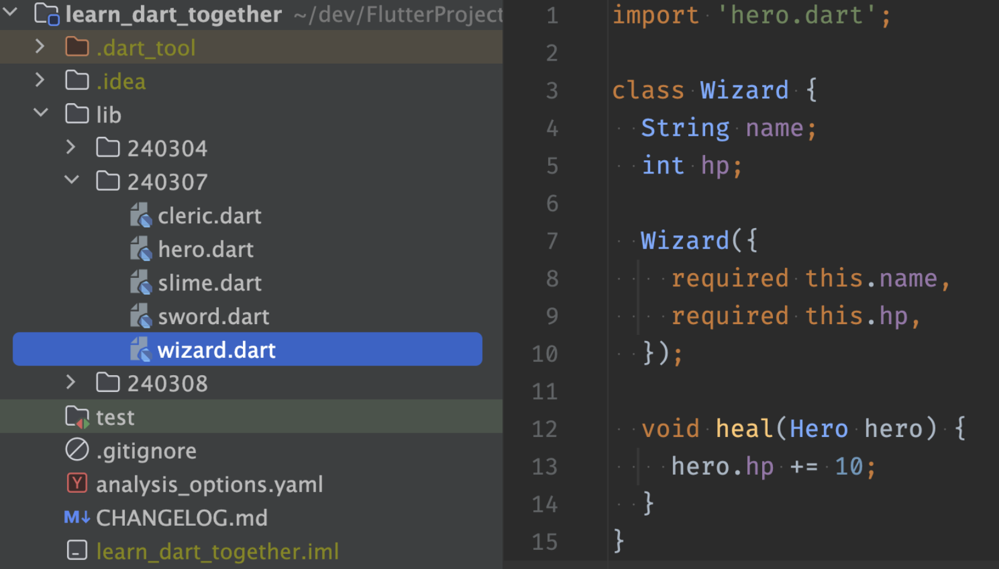

## 테스트 코드 작성 방법
### 1. 테스트 하고 싶은 파일을 고른다

### 2. test 디렉토리 아래에 동일 위치에 _test 를 붙인 파일을 작성한다

### 3. Test 코드 작성
- 여러가지 테스트 기법 중 given > when > then 기법을 사용한다
- expect() 함수를 활용한 결과 검증

```dart
void main() {
  test('Wizard Test', () {
    // given(준비)
    final wizard = Wizard(name: '마법사', hp: 100);
    final hero = Hero(name: '히어로', hp: 10);

    // when(실행)
    wizard.heal(hero);

    // then(검증)
    expect(hero.hp, equals(20));
  });
}
```
### 4. test 실행
#### 터미널
```
dart test
```
#### ide


---
### 참고
https://pub.dev/packages/test