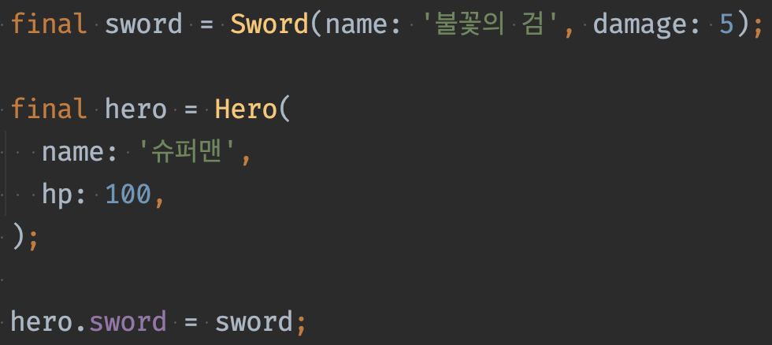
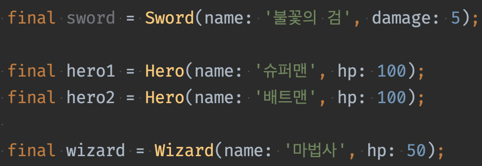
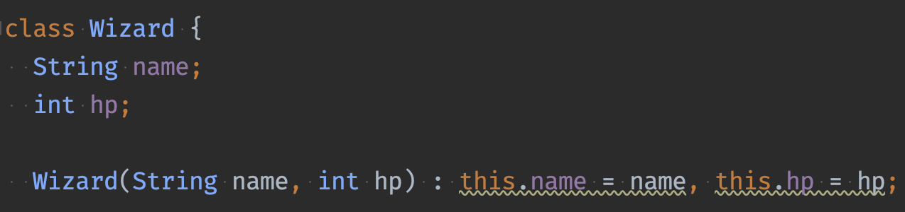
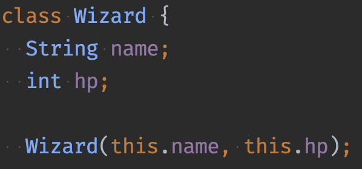

# 과제 피드백
## 리뷰 중요
리뷰 활동도 중요하다
요즘 개발하는 사람들은 다 할 줄 안다

## 코딩 컨벤션
- 약자를 쓰지말고 풀네임을 쓰면 좋다  
    - 최대한 구체적으로, 길게 써도 된다  
- 주석을 달지 않아도 이해할 수 있는 코드를 쓰자는 것이 요즘 컨셉
    - 요즘에는 주석 달라고 얘기하지 않는다  
    - 주석은 최대한 남기지 않는게 좋다

## matcher
- 테스트 코드에서 값을 검증하는 데 사용되는 도구
- 예시
    - equals: 두 값이 서로 같은지 확인
    - lessThan: 첫 번째 값이 두 번째 값보다 작은지 확인
    - lessThanOrEqualTo: 첫 번째 값이 두 번째 값보다 작거나 같은지 확인
    - greaterThan: 첫 번째 값이 두 번째 값보다 큰지 확인
    - greaterThanOrEqualTo: 첫 번째 값이 두 번째 값보다 크거나 같은지 확인
    - contains: 문자열이 특정 문자열을 포함하는지 확인
    - startsWith: 문자열이 특정 문자열로 시작하는지 확인
    - endsWith: 문자열이 특정 문자열로 끝나는지 확인
    - isTrue: 값이 true인지 확인
    - isFalse: 값이 false인지 확인
    - isNull: 값이 null인지 확인
    - isNotNull: 값이 null이 아닌지 확인
## expect 작성 예시
```dart
expect( (cleric.mp) <= cleric.maxMp, true );
```

## magic number 없애기
- 소프트웨어 개발 과정에서 사용되는 임의의 값을 줄여야 한다  
- 남들이 봤을 때는 뭔지 잘 모를 수 있다

-> 의미를 부여해서 상수로 정의하는 것이 좋다

## casacade notatioin 사용 예시
- 한 객체에 여러 프로퍼티나 메서드를 연속적으로 설정하거나 호출할 때 사용한다
    - 그런데 프로퍼티를 설정하는 식으로는 잘 안 쓴다
    - 프러퍼티를 초기화할 때는 생성자에서 받는 게 낫다
- return이 없지만 상태를 변경하는 메서드를 연속으로 쓰려고 할 때 사용한다 
```dart
class Person {
  String name;
  int age;

  void setName(String name) {
    this.name = name;
  }

  void setAge(int age) {
    this.age = age;
  }

  void printInfo() {
    print('Name: $name, Age: $age');
  }
}

void main() {
  var person = Person()
    ..setName('John')
    ..setAge(30)
    ..printInfo();
}
```

## 테스트는 최대한 다양하게
- 여러개를 테스트해서 다 되는지 보면 좋다
    - for문을 돌려서 mp를 0부터 10까지 해봐도 좋다
    - 경계값인 0과 10 정도는 해야 한다
- 최대한 검증할 수 있는 값들을 찾아서 해라
- 전부 테스트하지 않더라도 경계값인 0,1 or -1,-2만 하면 된다라고 보는 테스트 이론이 있다
- gpt에 물어보면 여러 테스트 케이스들을 알려준다
    - "mp, hp 회복 테스트를 하려고 한다. 검증용으로 하는데 혹시 빠진 케이스가 있는가 살펴봐라" 의견 구하기

## 테스트 내용은 디테일하게
- '최대 mp 테스트' 이것만 봤을 때는 의미를 모를 수 있다
- 코드를 쓰는 것보다 이것을 잘 쓰는게 낫다

## 코드 분석 툴
- SonarQube: https://www.sonarsource.com/products/sonarqube/
- CodePro Analytix: https://en.wikipedia.org/wiki/Rogue_Wave_Software
- Klocwork: https://www.perforce.com/products/klocwork
- Coverity Scan: https://scan.coverity.com/

## 함수에서 예외를 다루는 방법
1. 앞의 부분에서 if문으로 예외를 다 정의한다
2. 다 통과된다면 그 이하 과정을 수행한다
```dart
 int pray({required int praySeconds}) {
    if (praySeconds < 0) {
      throw Exception('기도 시간은 음수가 될 수 없음');
    }

    if (praySeconds == 0) {
      return 0;
    }

    final int recoverableMp = praySeconds + Random().nextInt(3);
    final int actualRecoveredMp =
        (recoverableMp + mp > maxMp) ? maxMp - mp : recoverableMp;
    mp += actualRecoveredMp;
    return actualRecoveredMp;
}
```

## min, max 잘 활용하기
```dart
final int actualRecoveredMp = (recoverableMp + mp > maxMp) ? maxMp - mp : recoverableMp;
// min을 활용하여 아래와 같이 수정 가능
final int actualRecoveredMp = min(recoverableMp, maxMp - mp);
```

## 함수에서 return은 한번만
- 중간에 return이 있는 코드를 가독성이 좋다고 평가하지 않는다
- 함수는 중간에 어떤 과정이 있고 출력은 마지막에 나가는 것이다
- 이것이 사람이 봤을 때 가장 이상적인 형태이다


## throw
- 예외를 발생시키는 데 사용된다
    - 일반적으로 예상치 못한 상황이 발생했을 때
    - 개발자가 명시적으로 에러를 표시하고 싶을 때
- 애매한 값보다 경계에 있는 것을 테스트 하는 것이 낫다

```dart
void checkAge(int age) {
  if (age < 18) {
    throw Exception('You must be at least 18 years old.');
  }
}

void main() {
  try {
    checkAge(15);
  } catch (e) {
    print('Caught an exception: $e');
  }
}
```

## setUp 함수
- 각 테스트 케이스를 실행하기 전에 실행되는 함수
    - 그러므로 각 테스트는 독립적으로 실행될 수 있다
- 테스트 케이스에 필요한 초기 설정을 수행하는 데 사용
    - 테스트에 필요한 객체를 생성
    - 데이터베이스 연결을 설정하는 등의 작업을 수행
```dart
import 'package:test/test.dart';

void main() {
  int counter;

  setUp(() {
    counter = 0;
  });

  test('counter should increment', () {
    counter++;
    expect(counter, 1);
  });

  test('counter should reset', () {
    expect(counter, 0);
  });
}
```

## setUpAll 함수
- 테스트가 시작될 때 딱 한 번만 실행
    - 데이터베이스 연결을 한 번만 설정
    - 테스트 데이터를 한 번만 로드하는 등의 작업

## final 상수는 parameter에 사용 X
- final이 붙은 상수는 런타임에 결정된다
- 현재 constant 하지 않은 값이기 때문에 parameter에 maxHP를 사용하지 못한다


## 메서드 통해서 해당 코드로 가는 법
커서 위에 두고 단축키 누른다  
안드로이드 스튜디오: 단축키 ctrl + B or cmd + B
vscode: cmd + 마우스 왼클릭

## 개발 공부 방법
- 최신 기술은 내 개인 프로젝트에 사용
- 서비스를 만들다가 필요한 부분 위주로 공부를 해 나가는게 가장 효과가 좋다
- 서비스(작은 것, 큰 것) 어떤 것 만들지 생각해놔라

# 클래스
## 레퍼런스 타입과 참조
코드를 작성하여 만들어 실행한다는 것은 무엇인가?  
그것이 메모리에 올라가는 것이다  

- dart는 모든 타입이 레퍼런스 타입
- 인스턴스를 만들면 힙 메모리 영역에 올라간다

## Hero 클래스를 인스턴스화 하여 이용 하는 코드
```dart
final hero=Hero(name: '홍길동', hp:100);
```
메모리 안에 주소가 있다  
내부적으로는 주소로 움직인다  


## 두 개의 Hero 형 변수

```dart
void main(){
	final hero1=Hero(name:'홍길동', hp: 100);
	final hero2 = hero1;
	hero2.hp=200;
	print(hero1.hp);
}
class Hero{
	String name;
	int hp;

	Hero({required this.name, this.hp=10});
}
```

## duplicate entire line
안드로이드 스튜디오: Cmd + D (Mac)  
vscode: Cmd + C (Mac)

## Sword 형 필드를 가지는 클래스


## 영웅에 검 장착


## 다른 타입을 인자나 리턴 값으로 사용


## 영웅을 인자(parameter)로 넘기는 예


## Dart에서는 모든 타입이 레퍼런스 타입
int, double, num, bool 등을 primitive type(기본 타입)이라 한다  
그런데 언어마다 다르다  
dart에서는 모든 타입이 레퍼런스 타입이지만  
기존 개발자들이 헷갈리지 않도록 소문자로 만들어놨다  
int, double, num, bool, String..

## 생성자
- 클래스의 인스턴스(객체)를 생성하고 초기화하는 특별한 메서드




### dart에서 줄여서 쓰는 법
initializer list

이것을 아래와 같이 줄여서 사용한다

this는 자기 자신을 가리킨다

### initializer list
- 클래스 생성자에서 필드를 초기화하는 특별한 방법
- 생성자의 본문이 실행되기 전에 필드를 초기화하는데 사용
```dart
class Point {
  final int x;
  final int y;

  // 생성자와 초기화 리스트
  Point(int x, int y)
      : this.x = x,
        this.y = y {
    // 생성자 본문
    print('Point initialized: ($x, $y)');
  }
}

void main() {
  var point = Point(10, 20);
}
```

### named parameter
- 생성자에 `{ }`를 사용하면 `named parameter` 
- 데이터 타입이 `Null`을 허용하지 않으면 `required`를 붙여야 한다
```dart
class Hero{
    String name;
    int hp;
    Sword? sword;

    //생성자
    Hero({
        required this.name,
        required this.hp,
        this.sword,
    });
}
```

```dart
void main(){
    final sword=Sword(name: '불꽃의 검', damage: 5);

    final hero1=Hero(name: '슈퍼맨', hp: 100);
    final hero2=Hero(name: '배트맨', hp: 100, sword: sword);
}
```

### positional parameter & named parameter
- 두가지를 동시에 사용할 경우 positional parameter가 앞에 와야 함
- 마지막 파라미터 뒤에 콤마를 찍을 수 없음

```dart
class Hero{
    String name;
    int hp;
    Sword? sword;
    
    // positional parameter와 named parameter를 동시에 사용할 수 있다
    Hero(this.name, this.hp, {this.sword});
}
```
```dart
void main(){
    final hero1=Hero('전사', 50);
    final hero2=Hero('검사', 100, sword: sword);
}
```

#### Constant consructor
- 안의 내용이 변경이 불가능할 때만 생성자 앞에 const를 붙일 수 있다
- 여러군데 사용하더라도 같은 메모리를 재사용한다
- 성능을 위해서 const 키워드를 붙여서 클래스를 만드는 경우가 있다
    - 플러터 코드를 짤 때, 이를 활용하여 최대한 성능 효율을 생각해서 작성하게 된다
```dart
class ImmutablePoint {
  final int x;
  final int y;

  // const 생성자
  const ImmutablePoint(this.x, this.y);
}

void main() {
  // 동일한 const 객체를 여러 번 사용
  const point1 = ImmutablePoint(10, 20);
  const point2 = ImmutablePoint(10, 20);

  // true: point1과 point2는 동일한 인스턴스를 가리킴
  print(identical(point1, point2)); // true
}
```

#### redirecting constructor
- 클래스 내의 다른 생성자를 호출하는 데 사용
- 중복된 초기화 코드를 피하고, 생성자 간의 코드 재사용이 가능하다
```dart
class Point {
  double x, y;

  // The main constructor for this class.
  Point(this.x, this.y);

  // Delegates to the main constructor.
  Point.alongXAxis(double x) : this(x, 0);
}
```
여기에서 this는 기본생성자인 `Point(this.x, this.y)`를 의미한다

### 기본값 지정

```dart
class Hero{
    String name;
    int hp;
    Sword? sword;

    //default 값 설정
    Hero(this.name, {this.hp = 100, this.sword})
}
```

### Dart의 메서드 오버로딩?
    오버로딩: 동일한 이름의 메서드를 여러 개 정의하는 것
- dart는 오버로딩을 직접적으로 지원하지 않는다
- 그러나 positional parameter와 named parameter를 사용하여 메서드 오버로딩과 유사한 효과를 구현
- 하나의 메서드에서 다양한 종류의 인수를 처리 가능

#### named parameter
```dart
class Hero{
	String name;
	int hp;
	Sword? sword;

	Hero({this.name='홍길동', this.hp=100, this.sword})
}
```
	1.	Hero()
	2.	Hero(name: '이몽룡')
	3.	Hero(hp: 80)
	4.	Hero(sword: mySword)
	5.	Hero(name: '이몽룡', hp: 80)
	6.	Hero(name: '이몽룡', sword: mySword)
	7.	Hero(hp: 80, sword: mySword)
	8.	Hero(name: '이몽룡', hp: 80, sword: mySword)
#### positional parameter
```dart
class Hero{
	String name;
	int hp;
	Sword? sword;

	Hero([this.name='홍길동', this.hp=100, this.sword])
}
```
	1.	Hero()
	2.	Hero('이몽룡')
	3.	Hero('이몽룡', 80)
	4.	Hero('이몽룡', 80, mySword)
	5.	Hero('홍길동', 80)
	6.	Hero('홍길동', 80, mySword)
	7.	Hero('홍길동', 100, mySword)

### 모든 클래스는 반드시 1개 이상의 생성자를 가진다
- 생성자를 1개도 작성하지 않으면 기본 생성자가 있는 것으로 본다
```dart
class Person{
    // 이렇게 정의할 필요 없다
    Person(){
    }
}
```

## 공유 변수를 만드는 법 2가지
### 1. static 키워드를 사용해 필드를 공유
- static 키워드를 통해 저장되는 메모리가 따로 있다
- 공유메모리(공유자원)라고 할 수 있다
```dart
class Hero{
    static int money=100;
    String name;
    int hp;
    Sword? sword;
}
void main(){
    // 인스턴스가 생성되어 있지 않아도 정적 필드에 접근된다
    Hero.money=200;
    print(Hero.money);
}
```
### 2. Top level 변수 활용
- top level 변수는 한번도 사용되지 않으면 메모리에 올라가지 않는다
```dart
int heroMoney=100;

class Hero{
    String name;
    int hp;
}
```
### 결론
둘다 상관없긴 하지만 field 내 type들과 연관이 있고 의미부여가 필요하다면 static으로 만든다  

## 코드 작성 팁
- 요즘에는 메모리를 아끼는게 중요한게 아니다  
- 인간이 잘 이해할 수 있는 코드가 중요하다

## static method (shared method)
- 클래스의 인스턴스에 속하지 않고 클래스 자체에 속하는 메서드
- 객체를 생성하지 않고 클래스 이름을 통해 직접 호출할 수 있다
- 정적 메소드 안에서 액세스할 수 있는 것은 정적 멤버만 가능하다
- 객체 상태와 무관하게 동작하는 유틸리티 함수나 공통 기능을 구현하는 데 사용
- 정적 필드와 정적 메서드는 클래스 로드 시 메모리에 할당되며, 클래스의 모든 인스턴스가 공유한다
```dart
class Hero{
	static int money =100;
    String name;
    int hp;
    Sword? sword;

    static void setRandomMoney(){
	    money=Random().nextInt(1000);
        print('$name의 소지금을 추가했다');
        // name에 접근 불가
        // 정적 메소드 안에서 액세스할 수 있는 것은 정적 멤버만 가능
    }
}

void main(){
    Hero.setRandomMoney();
    print(Hero.money);

    final hero1=Hero(name: '홍길동', hp: 100);
    print(Hero.money);
}
```