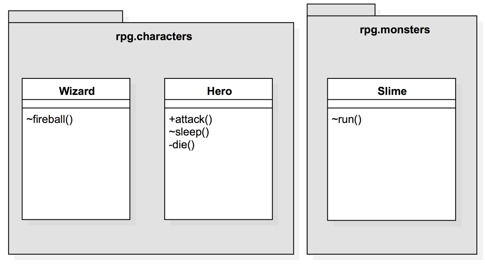

# 캡슐화
- 데이터와 메서드를 하나의 단위로 묶고, 외부에서 직접 접근하는 것을 막는다
- 데이터의 무결성이 보장된다
    - ex) 의료진을 제외한 환자나 다른 사람은 의료 기록을 수정하지 못한다
    - ex) 나이를 설정할 때 음수 값이 설정되지 않도록 한다
- 데이터의 보안성이 강화된다
    - 클래스 외부에서 직접 수정할 수 없다
    - 그러므로 의도하지 않은 접근이나 변경으로부터 데이터를 안전하게 보호한다

## access control이 되어 있지 않은 프로그램 사례
```dart
class Hero {
  static int money = 100;
  String name;
  int hp;
  Sword? sword;

  // 생성자· 생략

  void bye() {
    print('빠이');
  }

  void die() {
    print('죽었다');
  }

  void attack(Slime slime) {
    print('$name이 $slime을 공격했다.');
    print('슬라임인 반격을 받았다');
    hp -= 10;
    if (hp <= 0) {
      die();
    }
  }
}
```


### 여관 클래스의 값 입력 오류
```dart
class Inn{
    void checkIn(Hero hero){
        hero.hp = -100;
    }
}
```
hero 인스턴스에 hp에 -100이라는 값을 입력하고 있다 (human error)

### 외부 클래스에서 다른 클래스의 메써드에 접근하는 문제
```dart
class King{
    void callHero(Hero hero){
        print('용사님, 저희 왕국에 와주셔서 감사합니다.');
        print('용사님의 이름은 ${hero.name}이고, hp는 ${hero.hp}입니다.');
        hero.die();
    }
}
```

## dart에서 멤버에 대한 액세스 제어(access control)
접근 지정자 (access modifier)
|제한 범위|명칭|설정 방법|접근 가능한 범위|
|---|---|---|---|
|제한이 엄격|private|멤버 앞에 _붙이기|자기 자신의 클래스|
|제한이 느슨|public|기본값|모든 클래스|

### hp를 private로 지정
```dart
class Hero{
    static int money = 100;
    String name;
    int _hp;

    Hero({
        required this.name,
        required int hp,
        this.sword,
    }) : _hp = hp;
}
```

### die() 메소드를 private로 지정
```dart
class Hero{
    static int money = 100;
    String name;
    int _hp;

    void _die(){
        print('죽었다');
    }
}
```

### attack() 메소드는 public으로 지정
```dart
class Hero {
  static int money = 100;
  String name;
  int _hp;

  void _die() {
    print('죽었다');
  }

  void attack(Slime slime) {
    print('$name이 $slime을 공격했다.');
    print('슬라임인 반격을 받았다');
    _hp -= 10;
    if (_hp <= 0) {
      _die();
    }
  }
}
```

## 클래스 다이어그램
- 클래스와 클래스 간의 관계를 시각적으로 표현하는 도구
- 객체 지향 프로그래밍에서 시스템의 정적 구조를 나타내는 데 사용되는 UML(unified modeling language) 다이어그램의 한 종류


## getter와 setter
- 메소드를 통한 필드 조작  
- getter와 setter를 함수라고 생각하자

### getter
- 읽기 전용 프로퍼티를 구현할 때 쓴다
- 값을 얻을 때 쓴다
### setter
- 쓰기 전용 프로퍼티를 구현할 때 사용 (잘 안 쓴다)
- 값을 세팅할 때 쓴다

### hp와 die() 접근이 안 된다
```dart
class King{
    void callHero(Hero hero){
        print('용사님, 저희 왕국에 와주셔서 감사합니다.');
        print('용사님의 이름은 ${hero.name}이고, hp는 ${hero.hp}입니다.');
        hero.die();
        //hero.hp와 hero.die() 에러
    }
}
```

### hp getter 추가 방법
1. 람다식(한 줄 짜리 함수를 간단히 표현하는 방법
)
```dart
class Hero{
    static int money = 100;
    String name;
    int _hp;

    int get hp => _hp;
}
```
2. 함수식
```dart
class Hero{
    static int money = 100;
    String name;
    int _hp;

    int get hp {
        return _hp;
    }
}
```

### getter / setter의 장점
1. Read Only, Write Only 필드 구현 가능
    - 데이터를 읽거나, 혹은 쓰기만 할 수 있게 한다
2. 클래스 내부 설계 자유롭게 변경 가능
    - 필드의 이름을 바꾸거나 내부 구조를 바꿔도 외부 코드에 영향을 주지 않는다
3. 필드로의 액세스를 검사 가능
    - 데이터를 설정하거나 가져올 때 유효한 값인지 조건을 검사할 수 있다

### setter에서 값의 타당성 검사
```dart
String _name;

String get name => _name;

set name(String value){
    if (value.length <= 1){
        throw Exception('이름이 너무 짧습니다.');
    }
    if (value.length >= 8){
        throw Exception('이름이 너무 깁니다.');
    }

    _name = value;
}
```

### setter가 잘 기능하는지 확인
```dart
void main(){
    final hero = Hero(name: '홍길동', hp: 100);
    hero.name = 'a'; // '이름이 너무 짧습니다' excetipn 발생 (setter)
    print(hero.name); // (getter)
}
```

## 클래스에 대한 액세스 제어
함수, 변수와 동일한 규칙을 가진다
```dart
    class A {}
    class _B {}
```

## 결론
- 개발자의 잘못된 접근을 방지하고 제어 방법을 제공한다
- 캡슐화를 하면 멤버나 클래스로의 접근 제어가 가능하다
- 필드에 "현실세계에서 불가능한 값"이 들어가지 않도록 제어한다