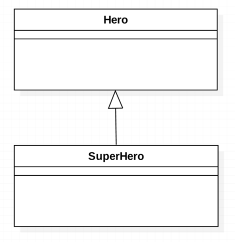
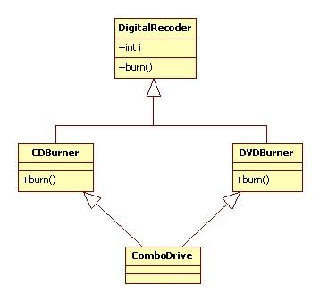
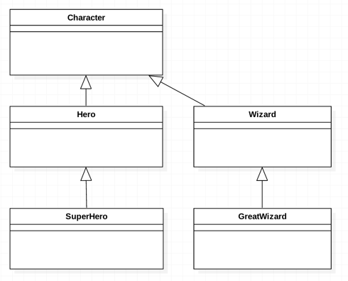

# 과제 피드백

## setupAll 과 setup 사용 차이
- setupAll을 쓰면 나머지 값들에 영향이 있을 수 있다
- side effect을 줄이기 위해 setup 사용을 추천한다

## null check 관련
- 언어에 null safety가 없다면 다 체크해줘야 한다
- 그런데 dart는 있기 때문에 그러지 않아도 된다

## getter의 역할
- getter는 데이터 캡슐화와 접근 제어를 위해 사용
- 단순한 로직 추가는 가능하지만, 복잡한 로직은 별도의 메서드로 분리하는 것이 바람직하다
- getter는 값을 얻는 역할에만 충실하도록 만들자

## 테스트 관련
- 테스트 때 경계에서 너무 먼 데이터를 넣지 않는 것이 좋다

# 상속

## Hero 클래스
```dart
class Hero{
    String name;
    int hp;

    void attack(Slime slime){
        print('$name이 $slime을 공격했다.');
        hp -= 10;
    }
    
    void run(){
        print('$name이 도망쳤다.');
    }
}
```

## SuperHero 클래스
```dart
class SuperHero {
    String name;
    int hp;
    Sword? sword;
    bool _isFlying = false; // 날고 있는지

    bool get isFlying => _isFlying;

    set isFlying(bool value) {
        _isFlying = value;
        if (value) {
            print('$name이 날개를 펼쳤다.');
        } else {
            print('$name이 날개를 접었다.');
        }
    }

    void attack(Slime slime) {
        print('$name이 $slime을 공격했다.');
        slime.hp -= sword?.damage ?? 5;
    }

    void run() {
        print('$name이 도망쳤다.');
    }
}
```

## 복사, 붙여넣기의 문제점
- 추가, 수정에 시간이 걸린다
- 소스의 파악 및 관리가 어려워진다
-> 상속을 활용한다

## 상속을 활용하자!
```dart
class SuperHero extends Hero {
    SuperHero({required super.name, required super.hp});

    bool _isFlying = false;

    bool get isFlying => _isFlying;

    set isFlying(bool value) {
        _isFlying = value;
        if (value) {
            print('$name이 날개를 펼쳤다.');
        } else {
            print('$name이 날개를 접었다.');
        }
    }
}
```
## SuperHero 생성
```dart
final hero SuperHero(name: '홍길동', hp: 100);
hero.run();
```


## 상속 관게 표현 방법

## 다중상속은 Dart에서 금지


## 오버라이드(override)
```dart
class SuperHero extends Hero {
    SuperHero({required super.name, required super.hp});

    bool _isFlying = false;

    bool get isFlying => _isFlying;

    set isFlying(bool value) {
        _isFlying = value;
        if (value) {
            print('$name이 날개를 펼쳤다.');
        } else {
            print('$name이 날개를 접었다.');
        }
    }

    @override
    void run(){
        print('$name이 퇴각했다.');
    }
}
```
## 결과를 예측
```dart
void main(List<String> arguments){
    final hero = Hero(name: '홍길동', hp:100);
    hero.run();

    final superHero = SuperHero(name: '한석봉', hp:50);
    sueprHero.run();
}
```

## 부모 객체를 참조할 수 있는 super 키워드
```dart
class SuperHero extends Hero{
    SuperHero({required super.name, required super.hp});

    bool _isFlying = false;

    @override
    void attack(Slime slime){
        // print('$name이 $slime을 공격했다.');
        // slime.hp -= 10;
        super.attack(slime);
        // 부모의 메서드를 참조할 수 있기 때문에 다시 작성할 필요가 없다

        if(isFlying){
            print('$name이 $slime을 공격했다.');
            slime.hp -=5;
            print('5포인트의 추가 피해를 입혔다.');
        }
    }

}
```

## 상속과 생성자
```dart
class Hero{
    Hero({required this.name, required this.hp, this.sword}){
        print('Hero 클래스의 인스턴스를 생성했습니다.');
    }
}

class SuperHero extends Hero{
    SuperHero({required super.nmae, required super.hp}){
        print('SuperHero 클래스의 인스턴스를 생성했습니다.');
    }
}

void main(List<String> arguments){
    final superHero = SuperHero(name: '한석봉', hp:50);
}
```

## 생성자를 호출하지 않았을 때의 에러가 나는 이유
- 부모에 생성자가 있었다면 꼭 호출해줘야 한다
- 이것이 바로 룰이다
- 원래는 this를 통해서 setter 등에 접근했다
- 부모한테는 super 키워드를 통해 super 클래스에 접근한다
```dart
class SuperHero extends Hero{
    bool _isFlying = false;

    @override
    void attack(Slime slime){
        super.attack(slime);
    }
}
```

## override
- 기존 기능을 재정의한다
- 메서드나 게터, 세터를 재정의할 때 사용
- IDE나 코드 분석 도구가 실수로 메서드를 잘못 재정의한 것을 감지할 수 있다

## @: annotation
- 있어도 그만, 없어도 그만이다
- 즉, 사용하든 사용하지 않든 돌아간다

## 최근 파일들 보기
안드로이드 스튜디오: command + E
vscode: command + P 후, @ 입력

## 최근 수정 파일들 코드로 보기
안드로이드 스튜디오: command + shift + E
vscode: ?

## 탭의 왼쪽 or 오른쪽으로 이동
안드로이드 스튜디오: ctrl + alt + ← or → 
vscode: command + Option + ← or → 

## 올바른 상속?
- 올바른 상속은 "is-a 원칙"이라고 하는 규칙에 따른 상속을 말한다
- 헷갈릴 때는 "is-a"인지만 기억해라
- 현실세계와 모순이 없게 만들어야 한다
- ex) SuperHero is a Hero (SuperHero는 Hero의 한 종류 이다)

## 잘못된 상속을 하면 안 되는 이유
잘못된 상속을 하게 되면 예상치 못한 결과를 초래하고 코드 유지 보수를 어렵게 만든다

1. 현실 세계와의 모순

    - 상속은 실제 세계의 객체 간의 관계를 모델링하기 위한 것이기 때문에, 잘못된 상속은 현실 세계에서 불가능하거나 의미가 없는 관계를 만들어낼 수 있다.

    - ex) House extends Item.  
현실 세계에서 집을 다른 물건처럼 던지거나 가방에 넣는 것은 불가능하다. 코드 오류와 예상치 못한 동작으로 이어진다.

2. 다형성 위반
    - 다형성은 서로 다른 하위 클래스의 객체들을 동일한 방식으로 처리할 수 있도록 하는 기능이다. 하지만 잘못된 상속은 다형성 기능을 방해할 수 있다.
    ```dart
        class Animal {
    void eat() {
        print("동물이 먹습니다.");
    }
    }

    class Fish extends Animal {
    void swim() {
        print("물고기가 헤엄칩니다.");
    }
    }

    class Bird extends Animal {
    void fly() {
        print("새가 난다.");
    }
    }

    class Penguin extends Bird {
    // 잘못된 상속: 펭귄은 날 수 없음
    void fly() {
        print("펭귄은 날 수 없습니다.");
    }
    }
    ```

## 구체화와 일반화의 관계
자식 클래스 일수록 `구체화` 되고,
부모 클래스 일수록 추상적인 것으로 `일반화`된다


