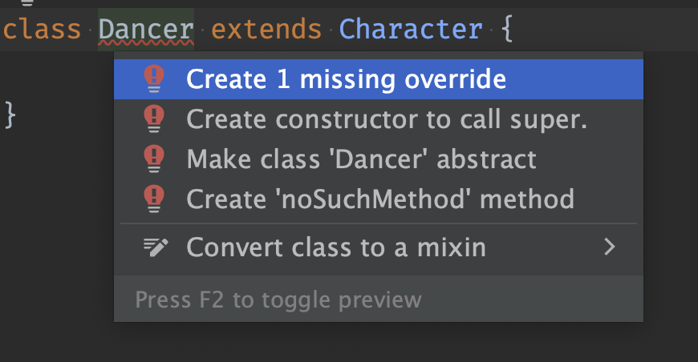
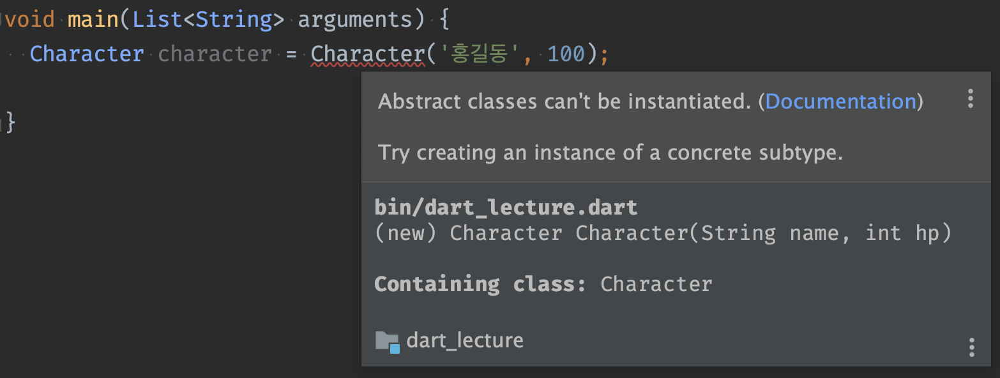
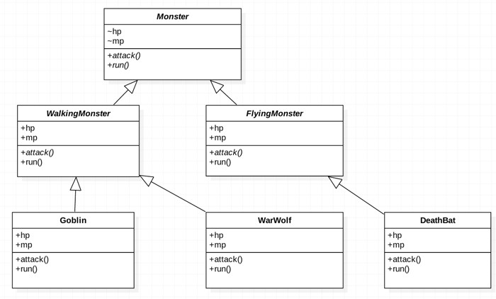

# 정리 피드백
## 일반 화살표
이것을 사용한다는 의미

## override 표시 문제
클래스 다이어그램을 그릴 때 '@override' 라고 쓰지 않아도
하위 클래스에 같은 메서드가 또 등장하면 override를 했다고 본다

## 클래스 상속 정리 팁
공통적인 것은 위로 올리면 된다

## 순환 참조(Circular Reference)
- 객체가 서로를 참조하여 참조 체인이 끝나지 않는 상황을 의미한다
- 이는 메모리 누수를 유발할 수 있다
- 이를 방지하고 메모리 해제를 확실히 하기 위해 Weak References, Factory Pattern, Observer Pattern의 방법들을 사용할 수 있다 (추후 공부)

# 추상클래스와 인터페이스
## 추상 클래스
### 상세 정의가 미정의인 메서드를 가진 클래스 Character
```dart
class Character{
    String name;
    int hp;

    Character(this.name, this.hp);

    void run(){
        print('$name이 도망쳤다.');
    }
    // 내용을 비워둔다
    void attack(Slime slime){}
}
```

### 미래의 개발자가 작성할 코드
```dart
class Hero extends Character{
    Hero(super.name, super.hp);

    @override
    void attack(Slime slime){
        print('$name이 $slime을 공격했다.');
        print('10의 데미지');
        slime.hp -= 10;
    }
}
```
### 오버라이드를 제대로 하지 않으면 발생하는 문제
1. override 자체를 하지 않은 경우
```dart
class Hero extends Character{
    Hero(super.name, super.hp);

    // attack()을 override 해야 하는데 하지 않았다
}

void main(List<String> arguments){
    Hero hero = Hero('슈퍼맨', 100);
    Slime slime = Slime('A');

    hero.attack(slime);
}
```
아무것도 실행되지 않는다 ({}이 실행된다)

2. override할 메서드의 철자를 틀린 경우
```dart
class Hero extends Character{
    Hero(super.name, super.hp);

    void atack(Slime slime){
        print('$name이 $slime을 공격했다.');
        print('10의 데미지');
        slime.hp -= 10;
    }
}

void main(List<String> arguments){
    Hero hero = Hero('슈퍼맨', 100);
    Slime slime = Slime('A');

    hero.attack(slime);
}
```
전혀 관계가 없는 메서드가 선언되었다

### 인스턴스화 되면 안 되는 클래스?
```dart
void main(){
    // Hero나 Wizard가 아닌 Character를 인스턴스화 하였다
    Character character = Character('홍길동',100);
    Slime slime = Slime('A');

    // 오버라이드 하지 않아서 아무 동작도 하지 않는다
    character.attack(slime);
}
```

### 추상클래스 정의
1. 상속의 재료로 사용되는 클래스
2. 상세 부분이 일부 미정의된 클래스

### 추상 클래스(abstract class) 및 추상 메소드 (abstract method) 사용법
```dart
// 추상 클래스
abstract class Character{
    String name;
    int hp;

    Character(this.name, this.hp);

    void run(){
        print('$name이 도망쳤다.');
    }

    // 추상 메서드
    void attack(Slime slime);
}
```

### 추상 클래스(abstract class) 및 추상 메소드 (abstract method) 특징
1. 오버라이드를 강제한다 (상속받은 하위 클래스에서 정의 하지 않으면 에러)


2. 인스턴스화가 금지되어 있다


3. 다계층의 추상 상속 구조가 가능하다


## 인터페이스
1. 모든 메소드가 추상 메소드여야 한다
2. 필드를 가지지 않는다

### 추상클래스 -> 인터페이스
```dart
    abstract interface class Human {
        void speak();
    }
```

### 세탁소 예시
```dart
abstract interface class CleaningService{
    Shirt washShirt(Shirt shirt);
    Towel washTowel(Towel towel);
    Coat washCoat(Coat coat);
}

class SuwonCleaningService implements CleaningService{
    @override
    Shirt washShirt(Shirt shirt){
        return shirt;
    }

    @override
    Towel washTowel(Towel towel){
        return towel;
    }

    @override
    Coat washCoat(Coat coat){
        return coat;
    }
}
```

### 인터페이스의 효과
1. 하나의 같은 인터페이스를 구현한 클래스들은 공통의 메소드를 구현하고 있다는 사실을 보장한다
2. 어떤 클래스가 인터페이스를 구현하고 있다면, 적어도 그 인터페이스에 정의된 메소드를 가지고 있다는 사실을 보장한다

### 인터페이스의 특별한 사용법

```dart
class SuwonCleaningService implements CleaningService, Store{}
```