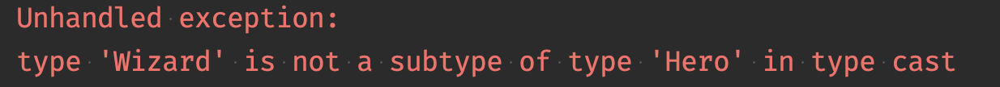
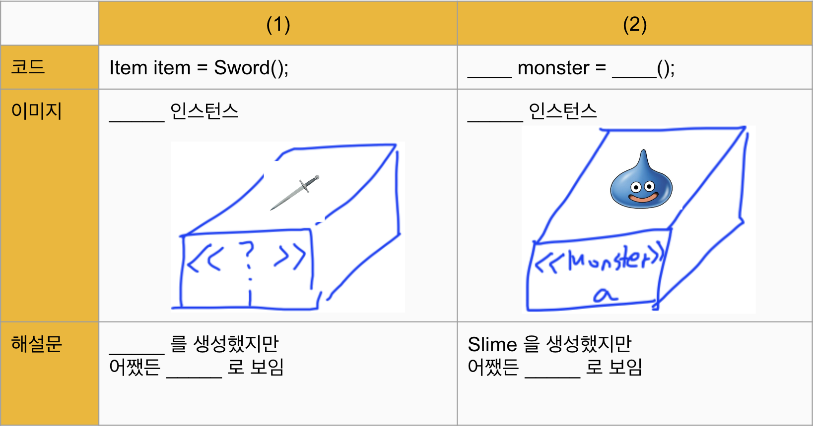

# 다형성
- 정의: 여러가지 형태를 가지는 성질
- 어떤 것을 이렇게도 부를 수 있고, 저렇게도 부를 수 있다
- 어떤 사물들의 특징을 모은 것이 인터페이스이다
- ex) 책: 자산, 유형자산, 물건
- 개발이 즐거워지게 하는 것?

## 다형성을 활용하는 방법
### 1. 공통 기능을 인터페이스로 정의한다
- draw는 원래 각 클래스에서 정의해야할 메서드이다
```dart
house.draw()
dog.draw()
car.draw()
```
- 하나의 인터페이스에 사용할 공통의 기능을 넣는다
```dart
abstract interface class Drawable {
	void draw();
}
```
#### 인터페이스 구현
```dart
class House implements Drawable {
	@override
    void draw() {
		...
    }
}
```
#### 인스턴스 생성시 인터페이스로 선언한다
```dart
Drawable element = House(...);
List<Drawable> elements = [ ];
elements.add(Dog(...));
```

#### Drawable = Rectangle ?
- Rectangle이지만 Drawable로 보인다
```dart
Drawable drawable = Rectangle(...);
```

### 선언은 상위 개념으로, 인스턴스 생성은 하위 개념으로 한다
- 추상적인 선언 = new 상세 정의
```dart
Character character = Hero('홍길동', 100);
```
- 왼쪽에는 인터페이스, 일반 클래스, 추상클래스가 올 수 있다
- 이를 통해 코드는 상위 클래스에 정의된 기능만 사용하게 되며,  
구체적인 구현은 인스턴스 생성 시 결정된다

## 다중 인터페이스 구현
```dart
abstract interface class Moveable {
	void move(int seconds);
}

class Car implements Drawable, Moveable
```

## 인터페이스에 정의되지 않은 메서드를 호출하는 경우
```dart
abstract interface Character{
  void attack(Slime slime);
}

class Wizard extends Character {
  // 생성자 및 다른 멤버들 생략

  @override
  void attack(Slime slime) {
    print('$name이 $slime을 공격했다.');
    slime.hp -= 20;
  }

  void fireball(Slime slime) {
    print('$name이 파이어볼을 쏘았다.');
    slime.hp -= 50;
    mp -= 20;
  }
}

void main(List<String> arguments) {
  Wizard wizard = Wizard('마법사', 50);
  Character character = wizard; // Wizard 객체를 Character 타입으로 참조
  Slime slime = Slime('A');

  character.attack(slime); // attack() 호출 가능
  character.fireball(slime); // fireball() 호출 불가능, 오류 발생
}
```

## 타입 변경 방법
- `as` 키워드를 사용한다
```dart
void main(List<String> arguments) {
  Monster monster = Slime('B');
  Slime slime = monster as Slime;
}
```
- 캐스트 실패하는 경우
```dart
void main(List<String> arguments) {
  Character character = Wizard('name', 10);
  Hero hero = character as Hero;
}
```

`Wizard`가 `Hero`의 서브타입이 아니다

### 인스턴스의 타입 체크 및 smart cast
```dart
void main(List<String> arguments) {
  Character character = Wizard('name', 10);
  if (character is Hero) {
    Hero hero = character;
  }
}
```

## 다형성의 장점: 동일한 타입으로 취급한다
- 코드를 중복하여 쓰지 않아도 된다
```dart
void main(List<String> arguments) {
  final characters = <Character>[]; // 빈 리스트 생성
  characters.add(Hero('슈퍼맨', 100));
  characters.add(Hero('배트맨', 200));
  characters.add(Wizard('해리포터', 50));
  characters.add(Wizard('헤르미온느', 50));

  characters.forEach((character) {
    character.hp += 50;
  });
}
```

## dart는 메소드 오버로딩 불가
```dart
class Hero extends Character {
  Hero(super.name, super.hp);

  @override
  void attack(Slime slime) {
    print('$name이 $slime을 공격했다.');
    print('10의 데미지');
    slime.hp -= 10;
  }

  void attack(Goblin slime) {
  }
  // 불가
}
```

## 구체화된 객체 대신 추상 클래스나 인터페이스를 인자로 받는다
```dart
class Hero extends Character {
  Hero(super.name, super.hp);

  @override
  void attack(Monster monster) {
    print('$name이 $monster을 공격했다.');
    print('10의 데미지');
    monster.hp -= 10;
  }
}
```

## 타입을 하나로 묶고, 한번에 동작하게 하기
```dart
void main(List<String> arguments) {
  final monsters = <Monster>[]; // 빈 리스트 생성
  monsters.add(Slime('A')); // run() 재정의
  monsters.add(Goblin()); // run() 재정의

  // 동작은 안에 담긴 객체를 따름
  monsters.forEach((monster) {
    monster.run();
  });
}
```


## 정리
### 인스턴스를 애매하게 퉁치기
- 상속에 의한 is-a 관계가 성립한다면, 인스턴스를 부모 클래스 타입의 변수에 대입할 수 있다
- 부모 클래스 타입 변수에 대입하는 것으로, 퉁 칠 수 있음

### 상자의 타입 과 내용의 타입 의 역할
- 어떤 멤버를 이용할 수 있는가는 상자의 타입이 결정한다
- 멤버가 어떻게 움직이는지는 내용의 타입이 결정한다


### 취급 변경
- as 키워드를 사용하여 타입 캐스팅을 수행한다
- is 키워드를 사용하여 타입을 검사할 수 있다

### 다형성
- 같은 부모를 가지는 다른 인스턴스를 동일시하여, 부모 클래스 타입의 에 담을 수 있다
- 마찬가지로, 부모 클래스 타입의 인수나 리턴 값을 이용하여, 다른 클래스를 모아서 처리 가능
- 동일시 취급 해도, 각각의 인스턴스는 각 클래스의 정의를 따르고 다른 동작을 한다.
