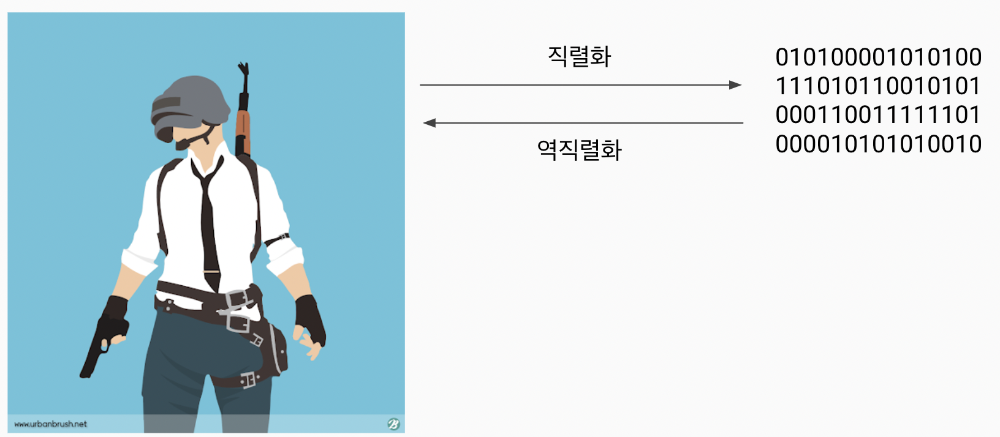

# 여러가지 데이터 형식
## CSV (Comma-Separated Values)
- 설명:
    - 데이터를 쉼표로 구분하여 저장하는 형식
    - 주로 표 형태의 데이터를 텍스트 파일로 저장할 때 사용
- 특징:
    - 각 행은 새로운 줄로 구분되고, 각 열은 쉼표로 구분된다
	- 간단하고 널리 사용되지만, 복잡한 데이터 구조를 표현하기에는 한계가 있다
- 예시:
    ```dart
    Name,Age,Location
    Alice,30,New York
    Bob,25,Los Angeles
    ```
- 라이브러리 활용: https://pub.dev/packages/csv

## Properties 파일 (프로퍼티 형식 파일)
- 설명:
    - 주로 키-값 쌍으로 구성된 설정 정보를 저장하는 파일 형식
    - Java 애플리케이션의 설정 파일로 많이 사용
- 특징:
	- 각 줄은 키와 값으로 구성되며, = 또는 : 기호로 구분돼.
	- 간단한 설정 데이터 저장에 적합
- 예시:
    ```dart
    database.url=jdbc:mysql://localhost:3306/mydb
    database.user=root
    database.password=secret
    ```
- 라이브러리 활용: https://pub.dev/packages/properties


## XML (eXtensible Markup Language)
- 설명:
    - 계층적인 데이터를 저장하고 전송하기 위한 마크업 언어
    - 태그를 사용하여 데이터를 구조화한다
- 특징:
	- 데이터가 태그로 둘러싸여 있으며, 계층 구조를 가진다
	- 사람이 읽기 쉽고, 데이터의 의미를 명확하게 표현할 수 있다
	- 웹 서비스, 설정 파일, 문서 저장 등에 널리 사용된다
- 예시:
    ```dart
    <person>
     <name>Alice</name>
     <age>30</age>
     <location>New York</location>
    </person>
    ```
- 라이브러리 활용: https://pub.dev/packages/xml_parser

## JSON (JavaScript Object Notation)
- 설명: 
    - 경량 데이터 교환 형식
    - 사람이 읽기 쉽고 기계가 분석하고 생성하기 쉽다
    - JavaScript 객체 문법을 기반으로 한다
- 특징:
	- 데이터가 키-값 쌍으로 구성되고, 중첩된 구조를 가질 수 있다
	- 웹 애플리케이션에서 서버와 클라이언트 간의 데이터 교환에 널리 사용
	- 많은 프로그래밍 언어에서 쉽게 파싱하고 생성할 수 있다
- 예시:
    ```dart
    {
        "name": "Alice",
        "age": 30,
        "location": "New York",
        "family": {"father": "fff", "mohter": "mmm"},
        "items": ["chair", "pen"]
    }
    ```
## 컴퓨터 세계에서의 직렬화의 의미
- 데이터 구조나 객체 상태를 저장하고 나중에 재구성할 수 있는 포맷으로 변환하는 과정
- 객체를 파일의 형태 등으로 저장하거나, 통신하기 쉬운 포맷으로 변환하는 과정을 의미
- 클래스 내부의 필드에 다른 클래스가 있다면 모두 직렬화 처리를 해줘야 함


## Dart에서의 직렬화 (Serialization)
- 직렬화 : 클래스 -> Json
- 역직렬화 : Json -> 클래스

## 직렬화, 역직렬화 가능한 클래스

```dart
class User {
  final String name;
  final String email;

  User(this.name, this.email);
  // fromJson(): json(실제로는 Map)으로부터 객체를 생성하는 생성자 (역직열화)
  User.fromJson(Map<String, dynamic> json)
    : name = json['name'],
      email = json['email'];
  // toJson(): 객체를 Json 형태로 표현하는 메서드 (직렬화)
  Map<String, dynamic> toJson() => {
    'name': name,
    'email': email,
  };
}
```

## 실제로 서버에서 JSON 형태의 String으로 들어온다
```dart
String jsonString = '{"name": "John Smith", "email": "john@example.com"}';
Map<String, dynamic> json = {"name": "John Smith", "email": "john@example.com"};
```

## String 형태의 JSON을 Map으로 변환
`jsonDecode`:
- JSON 문자열을 Dart 객체로 변환하는 함수
- JSON 형식의 데이터를 받아서 Dart의 Map이나 List와 같은 객체로 변환할 때 사용
```dart
import 'dart:convert';

String jsonString = '{"name": "John Smith", "email": "john@example.com"}';
Map<String, dynamic> json = jsonDecode(jsonString);
User user2 = User.fromJson(json);
```

## Map을 Json 형태의 String으로 변환
`jsonEncode`:
- Dart 객체를 JSON 문자열로 변환하는 함수
- Dart의 Map이나 List와 같은 객체를 JSON 형식의 문자열로 변환할 때 사용
```dart
import 'dart:convert';

Map<String, dynamic> json = {"name": "John Smith", "email": "john@example.com"};
String jsonString = jsonEncode(json);
```