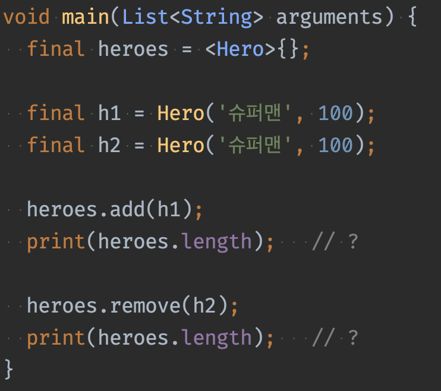
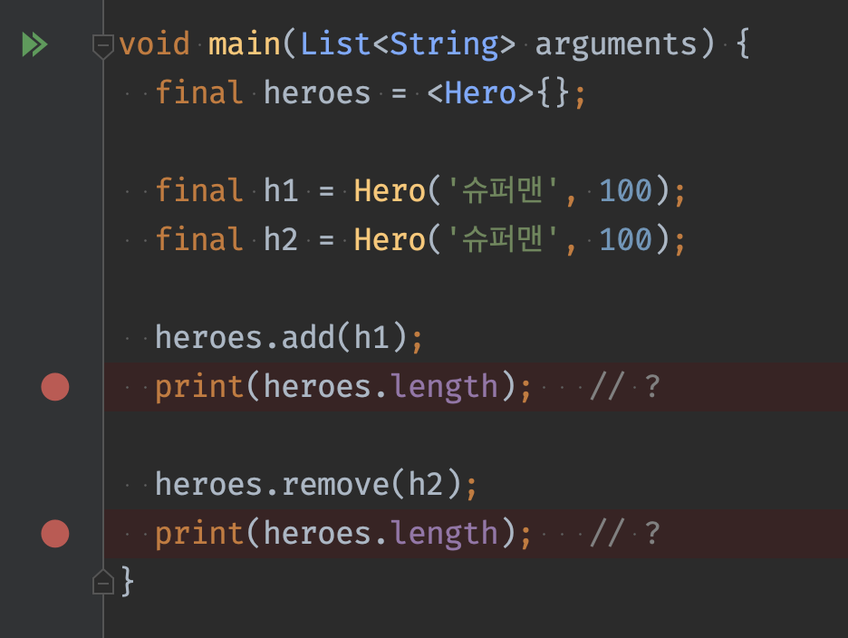
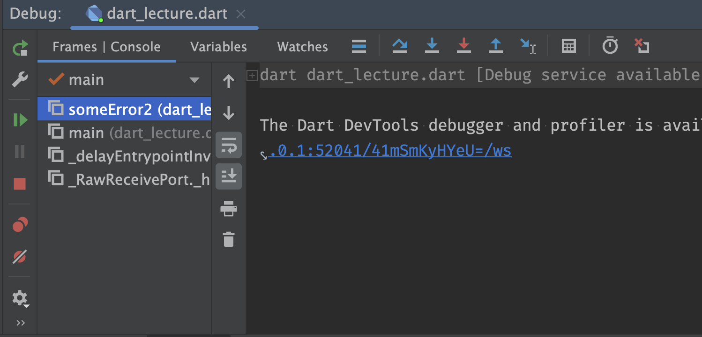
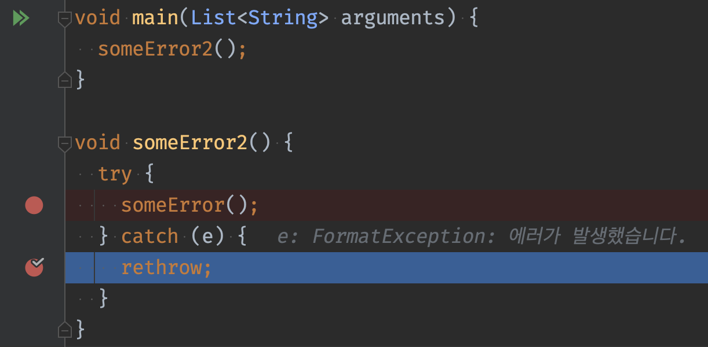
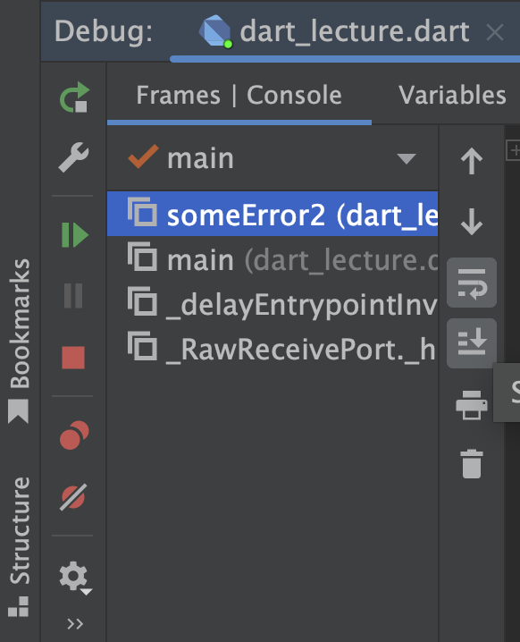

# 디버깅
- 소프트웨어의 오류를 식별하고 수정하는 과정

## 디버깅의중요성
- 소프트웨어가 올바르게 작동하는지 확인하는데 필수적이다 
- 디버깅하지 않으면 소프트웨어에서 오류가 발생하거나 제대로 작동하지 않을 수 있다

## 디버깅 기술
### 로깅
- 코드가 실행되는 동안 발생하는 이벤트를 기록하는 데 사용할 수 있다
- print() 함수를 활용하는 방법. Flutter 에서는 debugPrint() 등을 활용한다

### 브레이크포인트
- 코드의 특정 지점에서 실행을 중지하는 데 사용할 수 있다
- Debug 모드로 실행하여 원하는 위치에서 코드를 멈출 수 있다

### 디버거
- 디버깅을 도와주는 도구. 다양한 기능을 제공하며 디버깅을 더 쉽게 만들 수 있다
- 디버그 모드로 실행하여 브레이크 포인트에서 멈추거나 에러가 나면 다양한 도구를 활용하여 에러를 찾는데 도움이 된다

### 스택 추적
- 스택 추적은 호출 스택을 추적하여 코드가 실행 중인 위치를 확인하는 데 사용할 수 있다
- 어떤 경로로 코드가 실행되었는지 추적할 수 있다

## 디버깅 팁
- 작게 시작  
  디버깅할 때 작은 문제부터 시작하는 것이 중요합니다. 이렇게 하면 더 큰 문제로 넘어가기 전에 한 번에 한 가지 문제에 집중할 수 있습니다.
- 단순하게 유지  
  디버깅할 때 코드를 단순하게 유지하는 것이 중요합니다. 이렇게 하면 오류의 원인을 파악하기가 더 쉽습니다.
- 인내심을 가지세요  
  디버깅은 시간이 많이 걸릴 수 있으므로 인내심을 갖는 것이 중요합니다. 오류를 찾는 데 즉시 성공하지 못하더라도 낙심하지 마십시오.