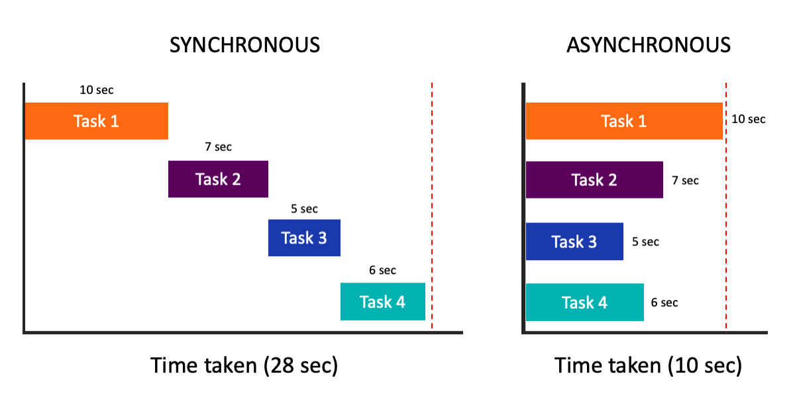
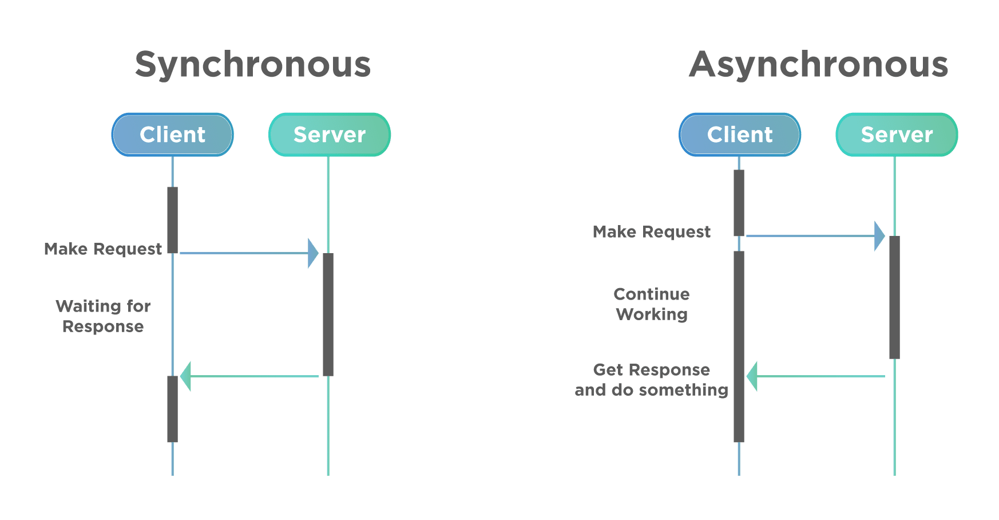

# 비동기 프로그래밍
## 동기(sync) 프로그래밍
- 코드가 순서대로 실행된다.
- 작업이 완료될 때까지 프로그램이 중단될 수 없다.
- 모든 작업은 이전 작업의 실행이 완료될 때까지 기다려야 한다.




## 비동기(async) 프로그래밍
- 임의의 순서로 또는 동시에 작업이 실행될 수 있다
- 비동기를 처리하는 방법에는 callback, Future, async - await 방식이 있다

## 콜백 함수
- 실행 가능한 함수를 인자로 전달하여, 특정 상황이 발생할 때 호출되게 하는 방식
- 비동기는 현재 코드의 실행 결과를 받지 않고 이후 코드를 수행하는 기법이다.
컴퓨팅 자원을 효율적으로 사용하는 기법이지만 정확한 순서를 지켜 수행하는지를 고려해야 한다. 비동기 코드를 순서대로 실행하는 가장 일반적인 방법으로 콜백(Callback)이 있다. (Java)
- Dart 에서는 콜백 이외에도 async - await 를 활용한 순차 실행 코드 작성을 지원하여 더 깔끔한 코드를 작성할 수 있다
- 현실 세계에서 콜백의 예시 :  
음식을 주문하고 진동벨을 가지고 기다리면 음식이 준비되면 손님을 호출(Callback)하는 상황

## 콜백으로 작성한 코드 (일부러 막 짠 코드)
- 함수의 실행순서가 보장된다
- 예상대로 잘 동작한다
- 그런데 3단계가 아니라 10단계라면?

```dart
final List database = [];

void main(List<String> arguments) {
 final result = register({
   'email': 'abc@abc.com',
   'password': '123456',
   'name': 'John Doe',
 });
 print(result.call());
 print(database);
}

Function register(user) {
 return saveDb(user, (user) {
   return sendEmail(user, (user) {
     return getResult(user);
   });
 });
}

Function saveDb(user, callback) {
 print('saving $user to db');
 return callback(user);
}

Function sendEmail(user, callback) {
 print('sending email to $user');
 database.add(user);
 return callback(user);
}

Function getResult(user) {
 return () => 'success register $user';
}
```

## Future
- 미래에 완료되는 객체
- Javascript 의 Promise 에 대응
- Future 는 ‘미래'에 받아올 값을 의미

```dart
Future<String> name;
Future<int> number;
Future<Person> person;
```

## async - await 문법
- async - await 는 비동기 코드를 작성할 때 더 깔끔한 코드를 제공한다
- await 키워드는 해당 Future 가 끝날 때까지 함수 실행을 기다린다

## 생존코딩 예외 처리의 정석
```dart
Future<String> getData() async{
    try{
        // 데이터를 가져오는 비동기 작업
        var data = await _getDataFromAPI();
        return data;
    } catch(error){
        // 데이터를 가져오는데 실패했을 때 처리
        print('데이터를 가져오는데 실패했습니다: $error');
        return '';
    }
}
```
- async - await 와 try - catch 조합이 훨씬 알기 쉽다

## 정리
1. 비동기를 다루는 방법을 모두 말 할 수 있어야 한다.
2. await 키워드 뒤에는 반드시 Future 타입이 와야 한다.
3. await 키워드는 async 키워드가 있는 함수에서만 사용할 수 있다.
4. 에러처리나 가독성, 처리상황에 따라 적절한 코드를 잘 선택할 수 있어야 한다.

## dart의 순차처리, 동시성, 병렬성 공부하기

### 동기 / 비동기 : 작업의 실행 방식
-	동기: 순차적으로 실행
-	비동기: 작업을 기다리지 않고, 나중에 완료될 것을 기대
###	동시성 / 병렬성 / 순차처리 : 작업의 처리 방식
-	동시성: 여러 작업이 동시에 실행되는 것처럼 보임
-	병렬성: 여러 작업이 실제로 동시에 실행됨
-	순차처리: 작업이 순서대로 하나씩 처리됨

## 동시성 (Concurrency)
- 여러 작업이 동시에 실행되는 것처럼 보이는 것을 의미한다
- 하지만 실제로는 한 번에 하나의 작업만 실행된다  

> ### Dart에서는?
> - Future와 Stream을 사용해서 동시성을 구현한다  
> - Future는 미래에 완료될 작업을 나타낸다
> - Stream은 여러 개의 비동기 이벤트를 순차적으로 처리할 수 있게 해준다
```dart
Future<void> fetchData() async {
  var data = await fetchFromServer(); // 서버에서 데이터를 가져오는 비동기 작업
  print(data);
}
```

## 병렬성 (Parallelism)
- 여러 작업이 실제로 동시에 실행되는 것을 의미한다
- 여러 코어를 가진 CPU에서는 각각의 코어가 다른 작업을 처리할 수 있다

> ### Dart에서는?
> - Isolate를 사용해서 병렬성을 구현할 수 있다
> - Isolate는 독립적인 메모리 공간을 가지는 별도의 스레드라고 생각하면 된다

```dart
import 'dart:isolate'

void isolateFunction(String message) {
  print('Message from main: $message');
}

void main() {
  Isolate.spawn(isolateFunction, 'Hello, Isolate!'); // 새로운 isolate에서 함수 실행
}
```

### 예제에 사용할 함수들
```dart
import 'dart:async';

Future<void> fetchData() async {
  print('데이터를 가져오는 중...');
  await Future.delayed(Duration(seconds: 2));
  print('데이터를 가져왔음!');
}

Future<void> performTask(int taskNumber, int delaySeconds) async {
  print('작업 $taskNumber 시작');
  await Future.delayed(Duration(seconds: delaySeconds));
  print('작업 $taskNumber 완료');
}
```
### 순차적 실행 예제
- 각 작업이 순서대로 실행됨
- 하나의 작업이 끝나야 다음 작업이 시작됨
- 모든 작업이 순차적으로 진행됨

```dart
import 'dart:async';

void main() async {
  print('프로그램 시작');
  
  // 작업을 순차적으로 실행
  await fetchData();
  await performTask(1, 1);
  await performTask(2, 1);
  await performTask(3, 1);
  
  print('프로그램 종료');
}
```

### 동시성 예제 (비동기 실행)
- fetchData와 performTask가 동시에 시작됨
- Future.wait로 모든 작업이 완료될 때까지 기다림
- 모든 작업이 동시에 진행되어 시간이 겹침

```dart
import 'dart:async';

void main() async {
  print('프로그램 시작');
  
  // 여러 비동기 작업을 동시에 시작
  fetchDataFuture = fetchData();
  task1 = performTask(1, 1);
  task2 = performTask(2, 1);
  task3 = performTask(3, 1);
  
  // 모든 작업이 완료될 때까지 기다림
  await Future.wait([fetchDataFuture, task1, task2, task3]);
  
  print('프로그램 종료');
}
```

### Future.wait이 없다면?
- Future.wait를 사용하지 않으면 비동기 작업들이 완료되기 전에 프로그램이 종료될 수 있다
- 모든 비동기 작업의 완료까지 기다리기 위해 Future.wait를 사용하는 것이 바람직하다
- 이를 통해 모든 작업이 올바르게 완료된 후에 프로그램이 종료되도록 한다