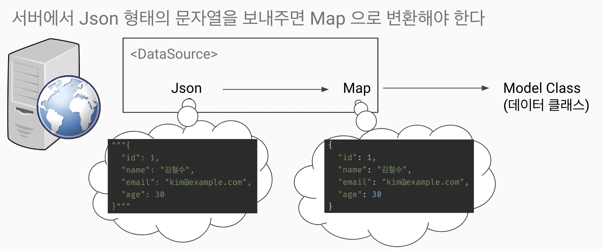

# 데이터 소스
- 데이터의 근간이 되는 원천 재료
- 내가 원하는 형태, 다루기 쉬운 형태로 바꿀 수 있어야 한다

## 각 데이터 소스의 장단점
| 데이터 소스 | 장점 | 단점 |
|-------------|------|------|
| **Text** | - 인간이 읽기 쉽고 이해하기 쉬움 </br> - 간단한 데이터 저장에 용이 | - 구조화되지 않아 검색 및 분석이 어려움 </br> - 대용량 데이터에 비효율 |
| **File** | - 간단한 저장 및 백업 가능 </br> - 파일 시스템을 통해 쉽게 접근 가능 | - 데이터 일관성 유지가 어려움 </br>- 복잡한 쿼리에 비효율 |
| **JSON** | - 가벼운 데이터 교환 형식</br> - 사람이 읽기 쉬움 </br> - 다양한 프로그래밍 언어에서 쉽게 파싱 가능 | - 대용량 데이터 처리에 비효율 </br> - 스키마가 없어 데이터 무결성 보장이 어려움 |
| **XML** | - 데이터와 메타데이터를 함께 저장 가능 </br> - 구조화된 데이터 표현에 용이함 | - 무겁고, 복잡한 구문으로 인해 가독성이 떨어짐 </br> - 파싱 속도가 느림 |
| **CSV** | - 간단한 데이터 구조 </br> - 대부분의 애플리케이션에서 지원 </br> - 사람과 기계 모두 읽기 쉬움 | - 데이터 타입에 대한 정보 부족 </br> - 대용량 데이터 처리에 비효율 |

`스키마(Schema)`: 데이터베이스의 구조와 제약 조건을 정의하는 청사진    
`데이터 무결성`: 데이터가 저장, 전송, 처리되는 동안 변형, 손실, 부정확함 등이 발생하지 않도록 하는 것

## Json 과 데이터 클래스의 상호변환
- 데이터 조작을 쉽게 편하게 한다
- 서버와 통신할 때 대부분 JSON으로 한다
참고 : https://docs.flutter.dev/data-and-backend/serialization/json
```dart
class User {
  final String name;
  final String email;

  User(this.name, this.email);

  User.fromJson(Map<String, dynamic> json)
      : name = json['name'] as String,
        email = json['email'] as String;

  Map<String, dynamic> toJson() => {
        'name': name,
        'email': email,
      };
}
```

## json 데이터를 가공하는 방법



## Json List String 을 List<모델>로 변경하는 법
- map() 함수를 활용한다

```dart
const jsonListString = """
[
  {
    "id": 1,
    "name": "김철수",
    "email": "kim@example.com",
    "age": 30
  },
   {
    "id": 2,
    "name": "김미미",
    "email": "kim22@example.com",
    "age": 50
  }
]""";

final jsonList = jsonDecode(jsonListString) as List;
List<User> users = jsonList.map((e) => User.fromJson(e)).toList();
```

## 실제 통신
```dart
import 'package:http/http.dart' as http;
import 'dart:convert';

void main() {
  http.get(Uri.parse('https://jsonplaceholder.typicode.com/todos/1'))
    .then((response) => jsonDecode(response.body)) // Map<String, dynamic>
    .then((json) => print(json));
}
```

## 모범 예제
```dart
import 'dart:convert';
import 'package:http/http.dart' as http;

class TodoDataSource {
  Future<List<Todo>> getTodos() async {
    final http.Response response = await http.get(Uri.parse('https://jsonplaceholder.typicode.com/todos'));

    // response.body는 JSON 문자열
    List<dynamic> jsonList = jsonDecode(response.body);
    return jsonList.map((e) => Todo.fromJson(e)).toList();
  }

  Future<Todo> getTodo(int id) async {
    final http.Response response = await http.get(Uri.parse('https://jsonplaceholder.typicode.com/todos/$id'));

    // response.body는 JSON 문자열
    final Map<String, dynamic> json = jsonDecode(response.body);
    return Todo.fromJson(json);
  }
}

class Todo {
  final int id;
  final String title;
  final bool completed;

  Todo({
    required this.id,
    required this.title,
    required this.completed,
  });

  factory Todo.fromJson(Map<String, dynamic> json) {
    return Todo(
      id: json['id'],
      title: json['title'],
      completed: json['completed'],
    );
  }
}
```

## 권장 디렉토리 구조
- data_souce
    - todo_data_souce.dart
    - user_data_souce.dart