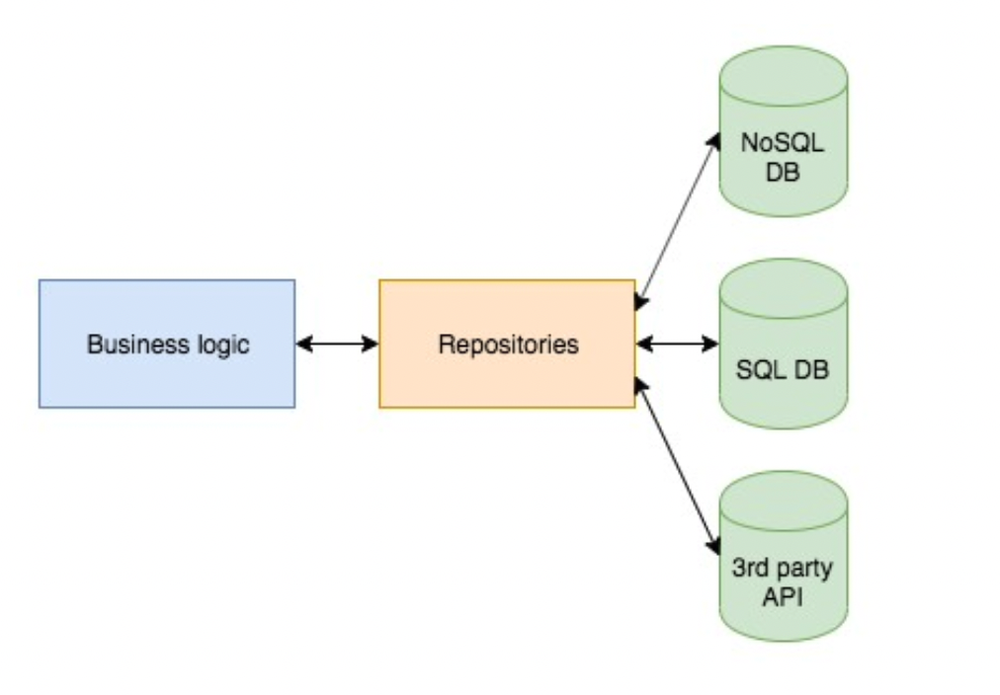

# 리포지토리
## 리포지토리 패턴
- 소프트웨어 개발에서 데이터 저장소에 접근하는 객체를 추상화하고, 
- 데이터소스(DB, File 등)와의 통신을 담당하는 객체를 캡슐화하는 디자인 패턴이다
- ex) 도서관에서 책을 빌리거나 반납할 때, 내부 시스템(데이터베이스)에 직접 접근하지 않고 사서(리포지토리)를 통해 접근한다. 



## 리포지토리의 책임과 역할
- 데이터 소스와 상호 작용하여 데이터를 추가, 조회, 수정, 삭제(CRUD)
- 데이터 캡슐화
- 데이터 추상화
- 데이터 접근 제어
- 예외 처리

## 비즈니스 로직과 데이터소스 분리의 이점
- 유지 관리성 향상
- 재사용성 향상
- 테스트 용이성 향상
- 확장성 향상
- *데이터 액세스 추상화*

## 리포지토리 클래스의 예시
- 실제로 DB를 조작하지만 외부에서는 내부 로직을 알지 못한다
- 데이터 조작을 캡슐화한다

```dart
class UserRepository {
  final _database = SqliteDatabase('users.db');

  Future<User> findUserById(String id) async {
    final results = await _database.query('users', where: 'id = ?', whereArgs: [id]);
    if (results.isEmpty) {
      return null;
    }
    return User(results[0]['id'], results[0]['name'], results[0]['age']);
  }

  Future<List<User>> findAllUsers() async {
    final results = await _database.query('users');
    return results.map((e) => User(e['id'], e['name'], e['age'])).toList();
  }

  Future<User> saveUser(User user) async {
    await _database.insert('users', user.toMap());
    return user;
  }

  Future<void> deleteUser(String id) async {
    await _database.delete('users', where: 'id = ?', whereArgs: [id]);
  }
}
```

## 확장을 고려한 리포지토리 패턴 예시
### 인터페이스 정의를 통한 추상화
```dart
abstract interface TodoRepository {
  Future<Todo> findTodoById(String id);
  Future<List<Todo>> getAllTodos();
}
```
### 인터페이스 구현체 작성
- 기본적인 데이터의 CRUD 를 제공한다
- 여러가지 버전의 impl 클래스가 작성될 수 있다
```dart
class TodoRepositoryImpl implements TodoRepository {
  final TodoDataSource _todoDataSource;

  TodoRepositoryImpl(this._todoDataSource);

  @override
  Future<Todo> findTodoById(int id) => _todoDataSource.getTodo(id);

  @override
  Future<List<Todo>> getAllTodos() => _todoDataSource.getTodos();
}
```

## 인터페이스 활용의 장점
- 객체지향 프로그래밍의 다형성을 잘 활용한 예
- 테스트가 용이하다

## 캐시 구현 예시
간단한 In Memory 캐시 구현
- 캐시가 비어 있으면 네트워크에서 데이터를 가져오고
- 캐시가 차 있으면 캐시의 데이터를 리턴한다

```dart
class TodoRepositoryImpl implements TodoRepository {
  final TodoDataSource _todoDataSource;

  // 네트워크로부터 받은 데이터를 캐시
  List<Todo> _todos = [];

  TodoRepositoryImpl(this._todoDataSource);

  @override
  Future<List<Todo>> getAllTodos({bool refresh = false}) async {
    if (refresh || _todos.isEmpty) {
      _todos = await _todoDataSource.getTodos();
    }
    return _todos;
  }
}
```