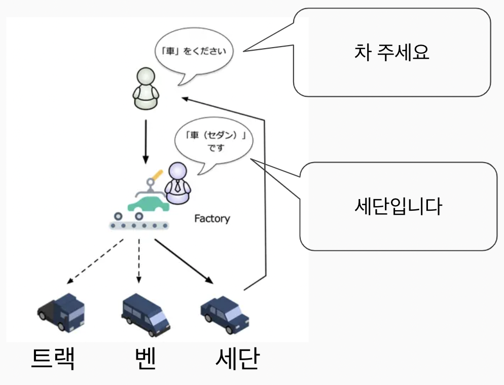
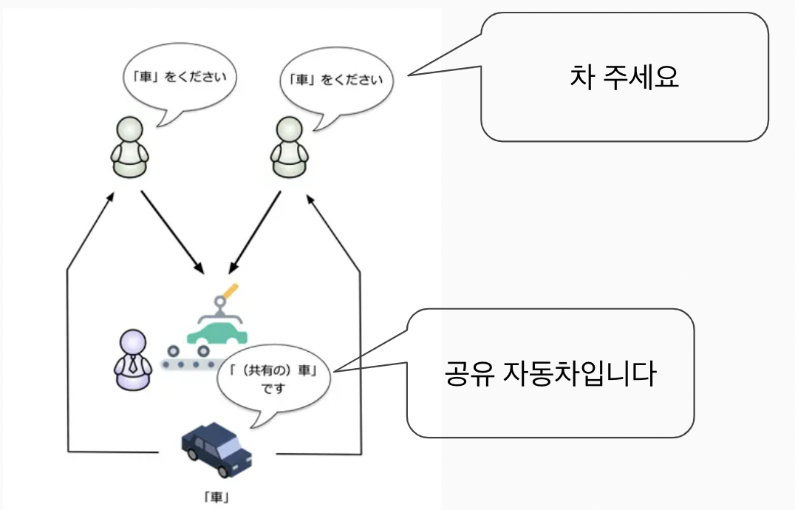

# 모델 클래스
## 책임 및 역할
- 내가 표현할 객체, 데이터를 조회할 수 있는 클래스
- 일반적으로 별도의 기능을 가지지 않는 순수한 클래스로 작성
- 그 이외의 기능은 추가하지 않는다
- 데이터 소스를 앱에서 필요한 형태로 변환한 데이터
- 앱 개발을 편리하게 해준다

## 권장 폴더 구조
- data
    - data_source
    - model
    - repository

## 또 다른 정의
- View에 보여질 데이터를 담는 객체
    - View == 눈에 보이는 부분
- 비슷한 용어들
    - 도메인 모델
    - Entity
    - DTO
    - POJO
    - VO
    - 데이터 클래스 (4종 세트 포함)

## 모델링 방법
### DDD (Domain Driven Design)  
- 도메인  
    - 유사한 업무의 집합
    - 특정 상황(주문, 결재, 로그인)이나 특정 객체(유저, 손님)가 중심이 될 수 있음
    - ex) 쇼핑몰에서 상품 관리, 주문 관리, 결제 관리 
- 모델 클래스
    - 도메인을 클래스로 작성한 것

> **클래스로 작성해야 하는 이유**  
> 그냥 JSON(Map) 으로 사용하면 안 될까?   
> JSON(Map)으로 사용하면 단순히 데이터 구조를 표현하는 데는 적합할 수 있지만, 도메인 로직과 데이터가 분리되어 유지보수와 확장성이 떨어진다


### ORM (Object-relational mapping)
    - 정의
    - 데이터 소스가 DB 인 경우 DB 와 모델간 상호 변환을 도와주는 기법
- ORM은 DB 를 활용할 경우에 따로 살펴봐도 됨

## 모델 클래스 작성 예시
### 일반 클래스
```dart
class User {
  String name;
  int age;

  User(this.name, this.age);

  @override
  String toString() => 'User(name: $name, age: $age)';
}
```
### 불변 객체
```dart
class User {
  final String name;
  final int age;

  const User(this.name, this.age);

  @override
  String toString() => 'User(name: $name, age: $age)';
}
```
### immutable 어노테이션
- immutable 어노테이션을 붙이면 불변이 아닌 경우,  
경고가 표시되는 Lint 가 동작함
```dart
@immutable
class User {
  final String name;
  final int age;

  const User(this.name, this.age);

  @override
  String toString() => 'User(name: $name, age: $age)';
}
```
### factory 생성자
- 인스턴스 생성 전에 특정 작업을 수행할 수 있다
- 인스턴스 생성 전 필요한 검증이나 초기화 작업을 수행할 수 있다
```dart
class User {
  final String name;
  final int age;

  factory User.fromJson(Map<String, dynamic> json) {
    return User(json['name'], json['age']);
  }

  const User(this.name, this.age);

  @override
  String toString() => 'User(name: $name, age: $age)';
}
```

## 디자인 패턴
### Factory 패턴
- 공장: 물건을 만드는 곳
- Factory 패턴: 인스턴스를 만드는 패턴



### Singleton 패턴
- 단 1개의 인스턴스만 생성되는 것을 보증하기 위한 패턴
- 인스턴스 생성을 여러번 시도해도 1개의 인스턴스가 공유된다
- 캐시나 공유 데이터, 처리의 효율화 등에 사용되는 테크닉



```dart
class RentCar {
  // static 인스턴스를 미리 생성
  static final RentCar _instance = RentCar._internal();
  int _count = 0;

  // factory 생성자
  factory RentCar() {
    return _instance;
  }

  // 내부에서만 사용할 named 생성자. (기본 생성자 금지 효과)
  RentCar._internal();
}

void main() {
  final instance1 = RentCar();
  final instance2 = RentCar();

  print(instance1 == instance2);  // true
}
```

## Model Class 결론
- 모델 클래스를 정의하는 방법은 여러가지가 있다
- 프로젝트의 성격에 따라 다양한 방식으로 모델 클래스를 정의할 수 있다
- 데이터 클래스 4종 세트 및 직렬화 2종이 필요하면 추가하여 사용한다
