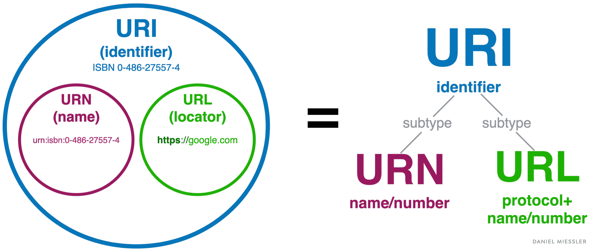
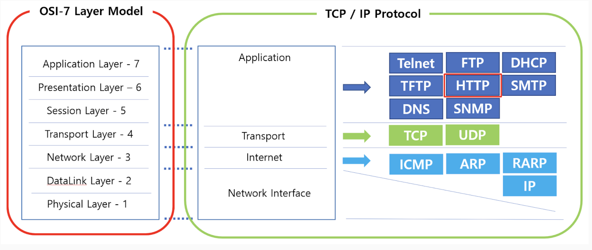

# 네트워크 통신
## URL을 사용한 고수준 액세스
- `고수준` : 사람이 이해하기 쉽게 작성된 프로그램 또는 API
- 복잡한 네트워크 작업을 쉽게 수행할 수 있게 도와주는 추상화된 인터페이스
- 사용자가 네트워크의 복잡한 세부 사항을 몰라도 쉽게 사용할 수 있게 설계되어 있다

## URL?
`URI`:
- 웹 상에서 리소스를 식별하기 위한 전체적인 개념
- URI는 URL과 URN으로 나뉜다

`URL`
- 특정 리소스의 위치를 식별하기 위한 방식
- 리소스가 어디에 있는지 나타내는 정보

`URN`
- 리소스의 이름을 식별하기 위한 방식
- 리소스가 어디에 있는지와 상관없이 그 리소스를 고유하게 식별할 수 있게 해준다

## HTTP (HyperText Transfer Protocol)
- 원래 문서 전송용으로 설계된 상태 비저장용 프로토콜
- 브라우저가 GET 요청으로 웹 서버의 문서를 읽어오는 용도였음
- 지금은 서버와 클라이언트가 텍스트, 이미지, 동영상 등의 데이터를 주고 받을 때 사용하는 프로토콜로 확장됨
- 웹 상에서 보는 이미지, 영상, 파일과 같은 바이너리 데이터도 HTTP 멀티파트나 Base64 인코딩하여 사용

### 네트워크 OSI-7 계층

### HTTP와 함께 사용하는 다른 기술들
- JSON 등을 HTTP와 함께 사용하는 RESTful API
- HTTP에 전송 계층 보안(TLS: Transport Layer Security)을 더해 만든 HTTPS

### 무상태성
- HTTP는 상태 비저장 프로토콜
- HTTP는 요청 메시지를 보내기 직전까지 대상 컴퓨터가 응답 가능한지 알 방법이 없다
- Stateless 프로토콜, 즉 상태가 없는 프로토콜
- Stateful 프로토콜로는 TCP (Transmission Control Protocol)가 있음

### HTTP 요청과 응답
- 모든 HTTP 메시지는 요청과 응답이 일대일로 대응되어야 한다
- `장점`: 클라이언트는 항상 자신이 보낸 요청에 대한 응답을 알 수 있어서 로직이 단순해진다
- `단점`: 클라이언트는 서버로 HTTP 요청을 보내기 직전까지 실제로 서버가 동작하는지 알 방법이 없다

### 실무에서의 HTTP 응답 없음
- 실제로 서버가 제대로 처리를 했어도 응답이 늦게 와서 타임아웃 나는 경우도 있다
- Android는 10초 이내(iOS는 60초)에 응답이 없으면 타임아웃으로 간주함

### 예측이 어려운 HTTP 응답 없음
- 서버가 다른 국가에 있는 경우
- 클라우드 기반의 서버
- MockServer 를 활용한 테스트 필요

### Web 페이지에 접속시 일어나는 일
- 브라우저에서 http://www.google.com 을 입력
- 브라우저가 http://www.google.com 으로 접속
- 페이지 내용이 HTML 형식으로 송신됨
- 브라우저가 HTML을 파싱하여 화면에 출력

## 4. 전송계층 프로토콜
