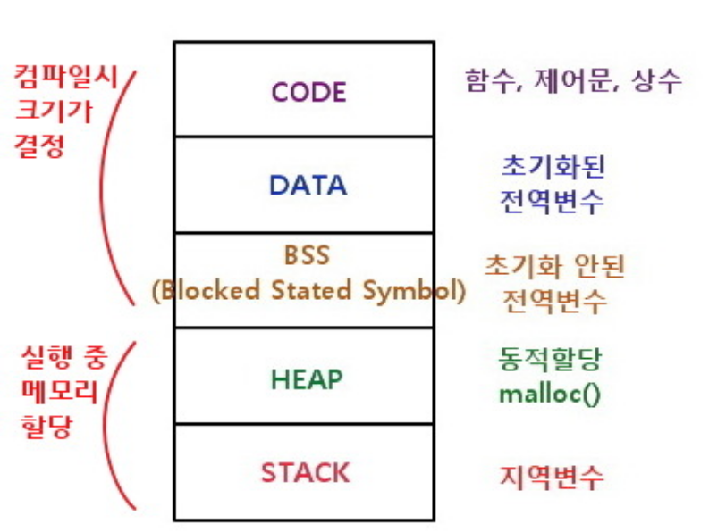

# 레퍼런스 타입과 참조

- 가상세계 = 컴퓨터의 메모리 영역
- 인스턴스 = heap 영역 안에 확보된 메모리
- 전역변수, 지역변수 별로 Memory 상에 할당되는 영역이 다르다.
- dart는 모든 타입이 레퍼런스 타입



```
final hero = Hero(hp: 100);
final hero2 = hero;
hero2.hp = 200;
print(hero.hp);
// result : 200
```

## 생성자

### 생성자 종류

https://dart.dev/language/constructors#use-initializing-formal-parameters

- Generative constructors: Creates new instances and initializes instance variables.
- Default constructors: Used to create a new instance when a constructor hasn't been specified. It doesn't take arguments and isn't named.
- Named constructors: Clarifies the purpose of a constructor or allows the creation of multiple constructors for the same class.
  Constant constructors: Creates instances as compile-type constants.
- Factory constructors: Either creates a new instance of a subtype or returns an existing instance from cache.
- Redirecting constructor: Forwards calls to another constructor in the same class.

### 특징

- Dart는 오버로드를 지원하지 않는다.
- 모든 class는 1개 이상의 생성자를 가지고 있다.
  - 따로 정의 하지 않아도 default로 가지고 있다.
- static은 static 끼리 메모리에 저장되는 영역이 따로 있다.
  - class의 객체가 생성되기 이전에 static field가 먼저 생성된다.
- static field는 static 메서드 내에서 사용해야 한다.
  - 일반 메서드에서 사용하면 Hero.money처럼 사용된다.
- static은 해당 클래스의 것이 아니다.
  - static method 내부에서 해당 클래스의 static이 아닌 field를 사용할 수 없다.

## cleric 업그레이드 과제

1.  Cleric클래스에 관하여, 2가지 수정을 하시오
    현시점의 Cleric 클래스의 정의에는, 각 인스턴스별로 최대 HP와 최대 MP 필드에 대한 정보를 가지고 있다. 하지만, 모든 성직자의 최대 HP 는 50, 최대 MP 는 10으로 정해져 있어, 각 인스턴스가 각각의 정보를 가지는 것은 메모리 낭비이다.
    그래서, 최대 HP, 최대 MP의 필드가 공유 되도록
    필드 선언에 적절한 키워드를 추가하시오

2.  아래의 방침에 따라, 생성자를 추가 하시오

- 이 클래스는 Cleric(“아서스", hp: 40, mp: 5) 와 같이, 이름, HP, MP 를 지정하여 인스턴스화 할 수 있다
- 이 클래스는 Cleric(“아서스", hp: 35) 와 같이, 이름과 HP만으로 지정하여 인스턴스화 할 수 있다. 이 때, MP는 최대 MP와 같은 값이 초기화 된다
- 이 클래스는 Cleric(“아서스") 와 같이 이름만을 지정하여 인스턴스화 할 수 있다. 이 때, HP 와 MP 는 최대 HP와 최대 MP로 초기화 된다
- 이 클래스는 Cleric() 과 같이 이름을 지정하지 않는 경우에는 인스턴스화 할 수 없다고 한다. (이름이 없는 성직자는 존재 할 수 없음)
  생성자는 가능한 한 중복되는 코드가 없도록 작성한다
