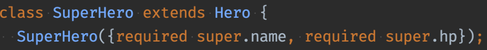

## 상속

- 자식 클래스에서 생성자를 사용할 때 부모의 생성자가 있으면 super을 이용하여 사용해야 한다.
  

- dart에서 다중 상속은 금지한다.
- mixin이라는 것이 있다.

```
class Hero {
  String name = 'ab';
  int hp = 10;

  Hero(this.name, this.hp);

  void attack() {}

  void run() {}
}

class SuperHero extends Hero {
  SuperHero(super.name, super.hp);

  @override
  void attack() {
    // TODO: implement attack
    super.attack();
  }

  @override
  void run() {
    // TODO: implement run
    super.run();
  }
}
```
