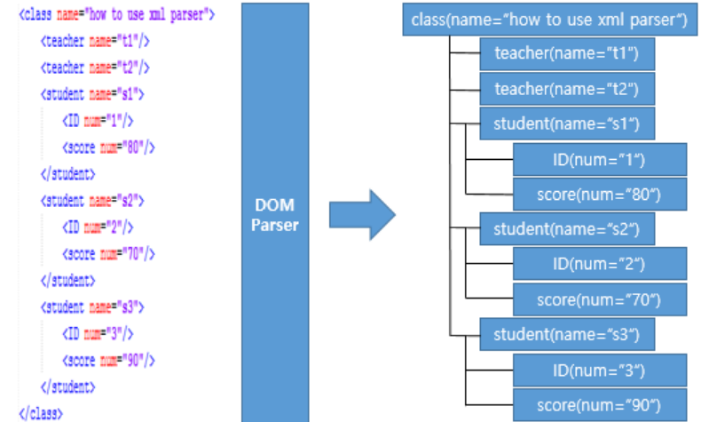
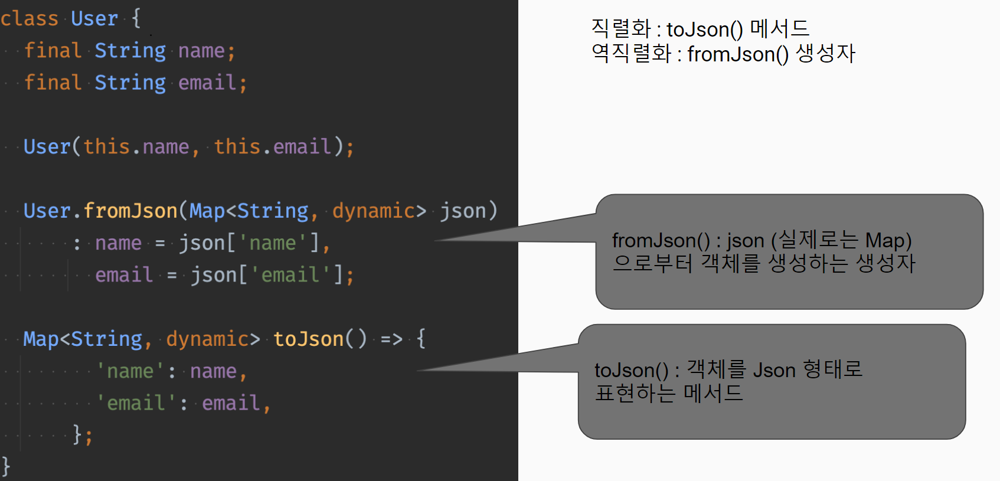

### CSV

- 데이터를 콤마로 나타낸 형식
  ` String str = "홍길동,한석봉,심사임당";`

### Properties

- Properties 클래스를 사용하여 키(key)와 값(value)의 쌍으로 읽고 쓰기가 가능

* data.properties의 내용:
  - heroName = 홍길동
  - heroHp = 100

### XML

- <> 태그를 활용한 방식

```
<note>
  <to>Move</to>
</note>
```

- 공공 데이터를 활용하려면 JSON뿐만 아니라 XML도 활용할 줄 알아야 한다.
- DOM Parser, SAX Parser 등을 통해 파서를 제작할 필요가 있음

### Parser

- Dom parser

  - XML를 파싱한 다음, 그 결과를 XML 문서와 1:1로 매핑되는 객체(Object)로 생성하고 메모리 상에 객체의 트리를 유지하여 관리하는 방식
    
  - 트리로 구성되어 있기 때문에 구조를 파악하기 쉬운 방식이지만, 읽는 XML 크기가 클 때는 트리도 커지기 때문에 메모리를 대량으로 소비한다는 단점 존재
  - 임의 노드 접근 용이

- SAX parser

  - XML 문서를 단-방향 스트림으로 취급하여 문서의 처음부터 끝까지 읽어들일 동안, 유효한 요소(태그, 속성, 텍스트 등)가 식별되면 그 이벤트를 파서의 외부로 전달하여 요소에 대한 처리를 수행하는 방식
    - 필요한 값은 개발자가 직접 저장
  - 큰 XML 파일 파싱때 유용
  - 간단, 빠름, 메모리 소모 적음
  - 특정 노드 탐색, 추가, 수정, 삭제 작업이 쉽지 않음

- 안드로이드에서는 XmlPullParser(=pull Parser)를 권장한다.
  - SAX 파서와 비슷한 이벤트 기반 방식
  - 특정 위치까지 파싱되어 내용을 처리한 후 계속 파싱할 것인지 멈출 것인지를 개발자가 제어할 수 있는 특징

### JSON

- 키(key): 값(value) 형태
- [] 로 리스트, {} 로 객체를 표현

```
{
  "이름" : "홍길동",
  "나이" : 25
}
```

### 직렬화

- 데이터 구조나 객체 상태를 저장하고 나중에 재구성할 수 있는 포맷으로 변환하는 과정
- 객체를 파일의 형태 등으로 저장하거나, 통신하기 쉬운 포맷으로 변환하는 과정을 의미
- 클래스 내부의 필드에 다른 클래스가 있다면 모두 직렬화 처리를 해 줘야 함

* 직렬화 : Class -> Json
* 역직렬화 : Json -> Class
  

* 실제 서버에선 Json형태의 String으로 데이터가 들어옴

  - json 형태로 바꿔줄 필요가 있음. (jsonDecode)

  * 서버로 보내줄 땐 String 형태로 바꿔서 보내줘야 함 (jsonEncode)
