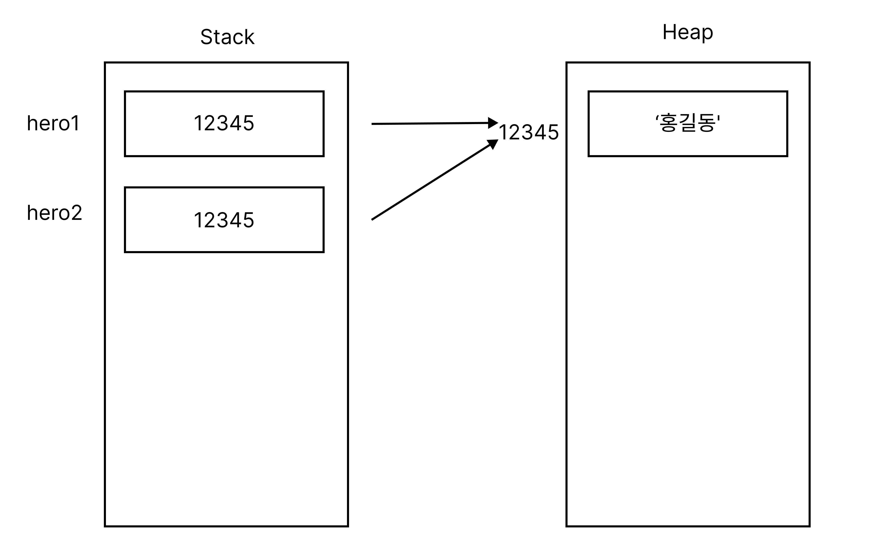

# class

## 메모리

* 가상세계 = 컴퓨터의 메모리 영역

* 인스턴스 = heap 영역 안에 확보된 메모리

* 메모리에 할당이 되면 객체의 주소가 지정된다.
* Dart는 모든 타입이 레퍼런스 타입 (=주소,숫자를 가지고 있다)이다.

### 레퍼런스타입

레퍼런스 타입의 변수는 데이터 자체를 직접 저장하는 것이 아니라, 해당 데이터에 대한 참조(메모리 주소 등)를 저장한다. 이는 변수가 실제 데이터가 저장된 메모리 위치를 가리키는
방식으로 작동한다.



## static

* 정적 멤버
* 공유자원
* 각 인스턴스가 아닌, 클래스에 실체가 준비된다.
* 인스턴스를 1개도 생성하지 않아도 이용 가능하다.
* 정적 메소드는 그 내부에 정적이지 않은 메소드나 필드를 이용하는 것이 불가능하다
* 컴파일타임에 미리 정해지는 메모리중에 const가 가장 먼저올라가고, static도 비슷하지만 조금 더 늦게 올라간다.
* 호출 방법

  ```dart
  class Class{
  static int hpmax;
  }

  void main(){
  Class.hpmax;
  }
  ```

## constructor

* default constructor
    * 기본 생성자. 생성자 만들지 않아도 기본적으로 하나 존재

* named constructor
    * 이름있는 생성자
* const constructor class
    * 안의 필드가 불변이어야 함
* 다트는 생성자 오버로드(동일한 이름의 함수 혹은 생성자 만드는 것)를 할 수 없다.
* {}를 사용해서 생성자 오버로드 효과를 가져올 수 있다.

## 테스트코드

* matcher
    * throwsException : 테스트코드에서 익셉션이 나는지 확인할 때 사용
    * returnsNomally : 익셉션의 반대
* 리스트에 담아서 비교할 수 있다.
* 테스트 코드에서 초기화가 필요한 경우 사용
    * setUpAll() : 한번만 돈다.
    * setUp() : 매번 돈다.