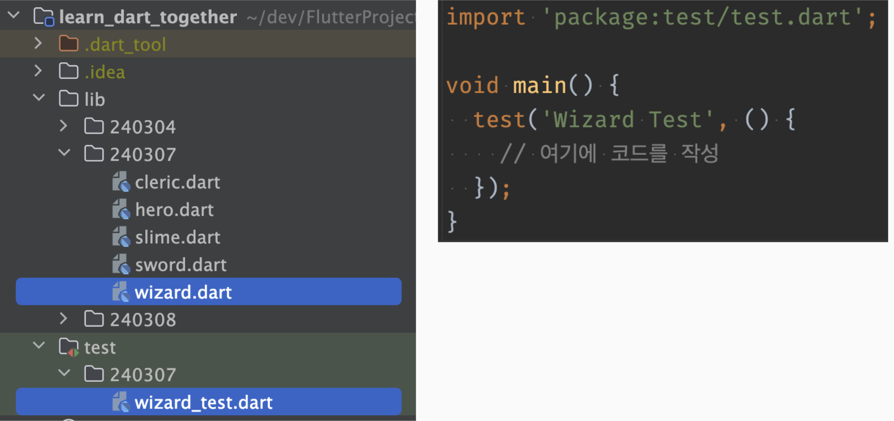

# Dart 기본 문법

## 공식 문서 참조하며 공부하기

- https://dart.dev/language

### top-level funcition : 아무데서나 쓸 수 있는 함수

- print 등

### type safe : 타입이 정해지면 타입 외에 값을 넣을 수 없다.

- 캐스팅은 제외
- js -> non-safe

### dart에서 함수의 type은 생략이 가능하나, 권장하지 않는다.

- 생략시 dynamic으로 type이 설정된다. (runtime 단계 때)
- js를 대체하려다 보니 dynamic이란 특징이 존재한다.
- ojbect는 모든 type을 담을 수 있는 최상위 class
  - object는 마지막에 들어간 변수의 type에 따라 결정된다. (compile 단계 때)
  - compile : 컴퓨터가 알아듣기 쉽게 기계어(어셈블리)로 바꾸는 변환 과정
    

### 변수보단 상수의 사용을 지향하자.

- 변수가 많으면 그만큼 개발자가 실수할 가능성이 높아지기 때문이다.

### `assert(조건)`

- 조건이 해당되지 않는다면 runtime 에러가 발생한다.
- 앱에선 이 구문이 무시된다. 따라서 debug용으로 사용하자.
- 또 다른 장점으론 간지가 있다

### const vs final

- const는 compile 타입 상수 (compile시 값 결정)
  - final에 비해 성능상 이점이 있다
  - 이와 같이 const의 초기화 표현식 생략 가능
    - `var foo = const [];`
    - `const Object i = 3; // Where i is a const Object with an int value...`
    - `const list = [i as int]; // Use a typecast. `
    - `const map = {if (i is int) i: 'int'}; // Use is and collection if.`
    - `const set = {if (list is List<int>) ...list}; // ...and a spread.`
- final은 runtime 타입 상수
- 대부분의 상수는 final로 사용하는게 마음이 편하다.

### num

- int와 double을 합친 개념
- dart에선 int와 double이 다른 언어와 다르게 서로 다른 타입이기 때문에 조심해서 사용해야 한다.

### late

- non-nullable과 구별하기 위해 사용하기도 한다.
  - 코드를 넘겨받은 개발자가 기존 non-nullable로 설계한 변수를 null로 사용하게 되면 문제가 발생한다. 따라서 late를 쓰기도 한다.
- 하지만 유지 보수 관점에서 안쓰는게 낫다.
  - late 변수를 사용했으나 이후 수정을 통해 사용 안하게 되면 runtime error가 발생하므로

## Operator

### 나눗셈

- / : `assert(5 / 2 == 2.5); `
  - Result is a double
- ~/ : `assert(5 ~/ 2 == 2); `
  - Result is an int

### null일 때 값 대입

- `String playerName(String? name) => name ?? 'Guest';`
