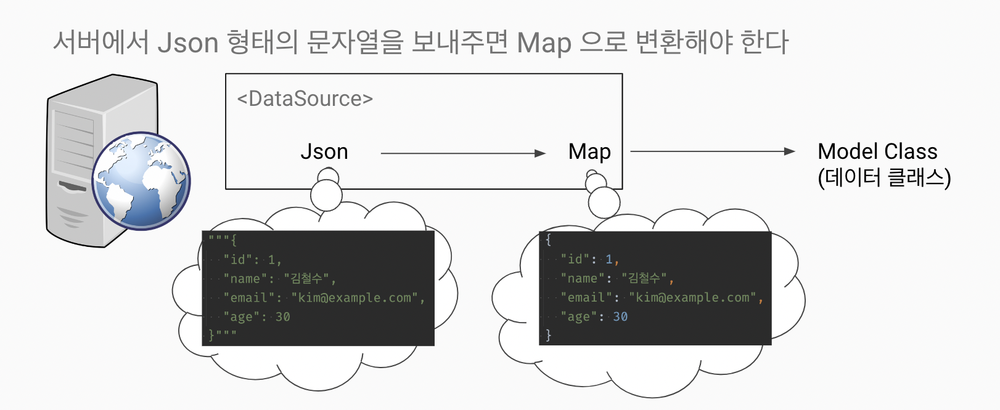

##DataSource

### 데이터 소스란?

* 데이터의 근간이 되는 원천 재료
* 프로그램이 사용하는 원천 데이터 모든 것이 해당한다.
* 데이터를 활용하기 위해 데이터 소스에서 추출한 가공되지 않은 데이터를 사용 가능한 데이터로 변환해야 한다.

### 데이터 소스의 종류

* Text
* File
* JSON
* XML
* CSV
* RDBMS
* NoSQL
* ...

### 실제 통신

* 서버와 통신 대부분을 JSON으로 한다.
* 실제 통신을 위해 사용되는 라이브러리로 http 가 있다.



### URI, URL

웹에서 리소스를 식별하는 데 사용되는 용어

* URI :일반적인 식별자, URL과 URN을 포함하는 개념
* URL: 웹에서 리소스의 위치를 식별하기 위한 특별한 형태의 URI

### 상황별 모범 답안

1. JSON 1개

```dart

final response = await
http
    .get
(
Uri.parse('https://jsonplaceholder.typicode.com/todos/$id'));
return Todo.fromJson(jsonDecode(response.body
)
);
```

2. JSON List

```dart

final response =
    await
http.get
(
Uri.parse('https://jsonplaceholder.typicode.com/todos/'));
//jsonString
final jsonString = response.body;
//to Map
final jsonList = jsonDecode(jsonString) as List<dynamic>;
return jsonList.map((e) => Todo.fromJson(e)).toList();

```