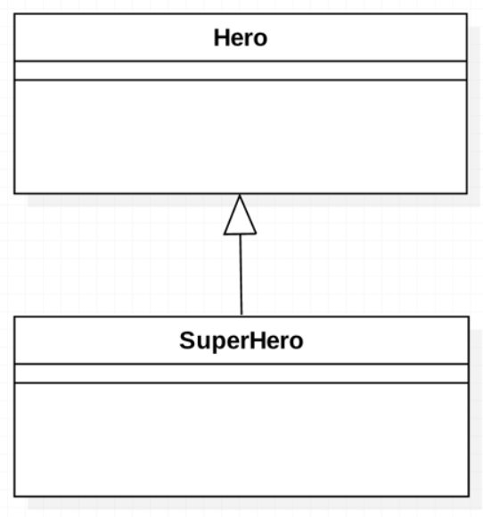

# Day6_상속(inheritance)

기존에 있는것을 확장한다.

### 복사 붙여넣기의 문제점

- 추가, 수정에 시간이 걸림
- 소스의 파악이나 관리가 어려워 짐
- 해결책으로 “상속”을 활용

### 올바른 상속

- 올바른 상속은 “is-a 원칙” 이라고 하는 규칙에 따른 상속을 말한다
- SuperHero is a Hero
(SuperHero 는 Hero의 한 종류 이다)

### 잘못된 상속

- 현실 세계의 등장인물 사이에 개념적으로 is-a 관계가 되지 못 함에도 불구하고
상속을 사용한 경우가 “잘못 된 상속” 이다.
- 예) 필드로 이름과 가격을 가지는 item 클래스 (약초,포션) 를 상속 받는 House

### 잘못된 상속을 하면 안 되는 이유

- 클래스를 확장할 때 현실세계와의 모순이 생긴다
- 객체 지향의 3대 특징 중 1가지 “다형성”을 이용할 수 없게 된다.

### 구체화와 일반화의 관계

- 자식 클래스 일 수록 구체화 되고, 부모 클래스 일 수록 추상적인 것으로 일반화 된다.