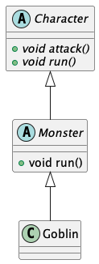

# Day7_추상클래스&인터페이스

# 추상클래스(abstract)

- 상속의 재료로 사용되는 클래스
- 일부 상세 부분이 미정의 된 클래스
- 오버라이드를 강제 할 수 있다.
- 인스턴스화가 금지되어 있다.
- abstract 키워드를 사용한다.

```dart
void attack() // 강제 오버라이드 O
void attack(){} // 강제 오버라이드 X

//일부 상세 부분이 미정이 된 클래스 
abstract class Character {
  void attack();

  void run() => print('달린다');
}

//미정이된 부분만 구현
class Monster extends Character {
  @override
  void attack() => print('공격시작');
  
}
```

<aside>
💡 다이어그램에서 
추상 메서드는 이탤릭체로 표기된다.



</aside>

# 인터페이스(interface)

- 모든 메소드는 추상 메소드 여야 한다.
- 필드를 가지지 않는다.
- 복수의 인터페이스를 부모로 두는 다중상속 효과가 가능하다.

```dart
//다중상속 효과 
abstract interface class A {}
abstract interface class B {}

class Animal implements A, B {}

```