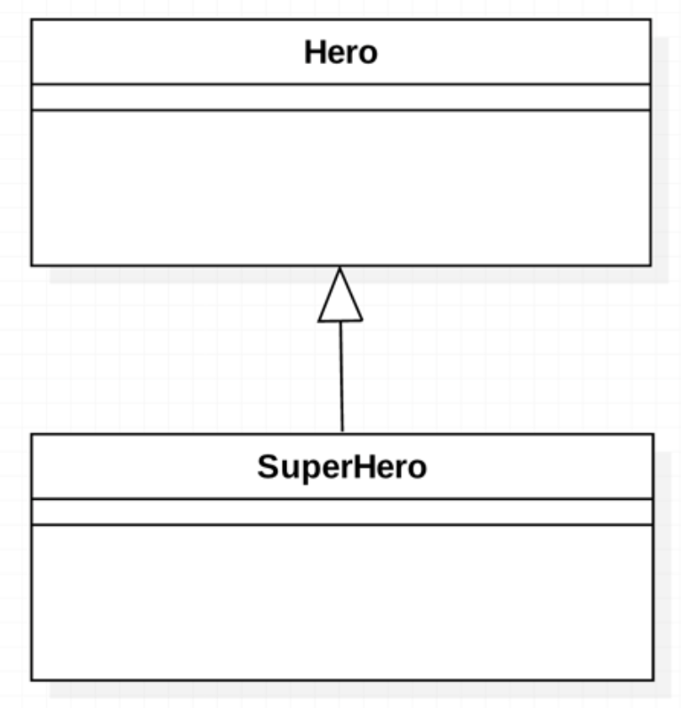

# inheritance

### 상속

* 이전에 만든 클래스와 닮았지만 일부 다른 클래스를 만들어야 하는 상황에 상속을 사용하면 유용하다.
* 수정에 소요되는 시간이 감소되고 소스의 파악과 관리가 쉬워진다.
* 부모 클래스의 모든 것을 물려준다. 상속이라는 단어보다 계승이 적합하지 않을까
* 기존 클래스의 확장

* Hero 클래스
  ```dart
  class Hero {
    String name;
    int hp;

    Hero(this.name, this.hp);

    void run() {
      print('$name이 달린다');
    }
  }
  ```

* Hero를 상속받은 SuperHero 클래스
  ```dart
  class Superhero extends Hero{
    int power;
    Superhero(super.name, super.hp, this.power);
    
    void fly(){
      print('$name이 달린다');
    }
  }
  ```

상속을 받으면 부모클래스의 모든 속성을 자식클래스가 부여받는다.

다중상속은 불가능하다.

### 표현방법



* 올바른 상속

  올바른 상속이란 'is a' 원칙에 부합하는 상속을 말한다.
  `Class Superhero extends Hero`에서
  `Class Superhero is a Hero` 가 성립하면 올바른 상속이다.

* 잘못된 상속

  'is a'관계가 성립되지 못함에도 상속을 사용한 경우.

  잘못된 상속을 하게 될 경우 클래스를 확장할 때 현실세계와 모순이 생기며 '다형성'을 사용할 수 없게 된다.

  속성으로 들어가야할 만한 것이 class 이면 안된다.

### 오버라이드

* 기존의 정의를 재정의 한다.

* 하위 클래스가 상위 클래스의 기능을 그대로 이용하는 것이 아니라, 추가 또는 변경이 필요한 경우에 사용.

  ```dart
  class TimesTwo {
    final int number;

    TimesTwo(this.number);

    int calculate() {
      return number * 2;
    }
  }   
  ```

  ```dart
  class TimesFour extends TimesTwo {
    TimesFour(super.number);

    @override
    int calculate() {
      return super.number * 4; //super 삭제 가능
    }
  }
  ```

  super 키워드를 사용해 부모클래스의 메서드 그대로 가져와서 만들 수도 있다.

  ```dart
  int calculate() {
        return super.calculate() * 2;
  }
  ```
